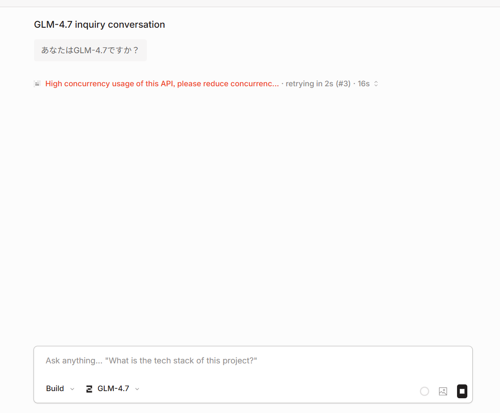

【結論】OpenCode ZenでGLM-4.7が選択可能だが、現時点ではエラーで動作しない状況。

## OpenCode Zenとは

OpenCodeは、ターミナルやIDE、デスクトップで動作するオープンソースのAIコーディングエージェントです。Claude、GPT、Geminiなど様々なモデルに対応しています。

その中で「OpenCode Zen」というサービスがあり、コーディングエージェント向けにテスト・最適化されたモデルセットにアクセスできます。

## GLM-4.7が選択肢に

OpenCodeの設定画面から「Connect OpenCode Zen」を選択すると、Zenへの接続画面が表示されます。

opencode.ai/zen にアクセスすると、APIキーがそのまま表示されており、すぐに利用開始できる仕組みになっています。

選択可能なモデルの中に、Zhipu AIの**GLM-4.7**が含まれていました。

## 実際に試してみると...

「あなたはGLM-4.7ですか？」と質問してみたところ、残念ながらエラーが発生しました。

> High concurrency usage of this API, please reduce concurrenc...

という表示が出て、リトライを繰り返している状態でした。

【注意】現時点では高負荷のためか、GLM-4.7は正常に応答しない状況です。

## まとめ

- OpenCode Zenに登録するとAPIキーが発行される
- 利用可能モデルにGLM-4.7が含まれている
- 現時点ではエラーで使用できないが、無料で試そうとしている挙動は確認できた

今後改善される可能性があるので、気になる方はチェックしてみてください。

**参考リンク:**
- [OpenCode公式サイト](https://opencode.ai)
- [OpenCode Zen](https://opencode.ai/zen)
