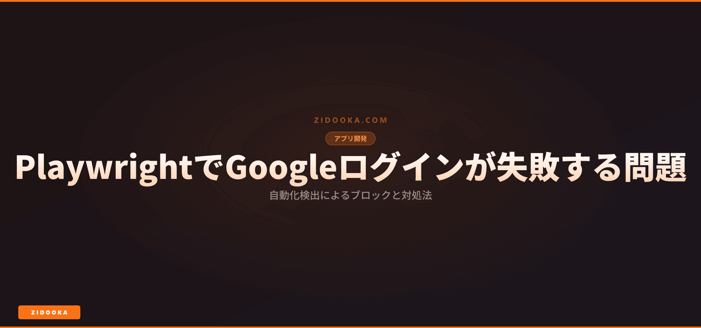

PlaywrightやSeleniumなどの自動化ツールでGoogleアカウントにログインしようとした際、「このブラウザまたはアプリは安全でない可能性があります」というエラーが表示され、ログインできないことがあります。

これはGoogleのセキュリティ対策により、ヘッドレスブラウザや自動化ツールを検出してブロックしているためです。



## なぜブロックされるのか

Googleは以下の特徴から自動化ブラウザを検出しています。

| 検出要素 | 説明 |
|---------|------|
| `navigator.webdriver` | 自動化ツールではこのフラグが`true`になります |
| ヘッドレスモード | ウィンドウサイズやフォントレンダリングの違いが検出されます |
| User-Agent | Chromiumや自動化ツール特有のUAが含まれます |
| ブラウザ指紋 | WebGL、Canvas、プラグインなどの不自然な値 |

## 対処法

### 方法1: 既存のブラウザプロファイルを使用する

Chromiumの既存のユーザープロファイルを指定することで、検出を回避できます。

```javascript
const { chromium } = require('playwright');

const browser = await chromium.launch({
  headless: false,
  args: [
    '--user-data-dir=/path/to/your/chrome-profile',
    '--profile-directory=Default'
  ]
});
```

:::note
Chromeのプロファイルパスは以下の場所にあります。
- Windows: `%LOCALAPPDATA%\\Google\\Chrome\\User Data`
- Mac: `~/Library/Application Support/Google/Chrome`
- Linux: `~/.config/google-chrome`
:::

### 方法2: 非ヘッドレスモードで起動する

ヘッドレスモードを避け、実際のブラウザウィンドウを表示します。

```javascript
const browser = await chromium.launch({
  headless: false
});
```

### 方法3: 専用の認証済みセッションを使用する

事前に手動でログインし、セッションCookieを保存・再利用します。

```javascript
// 保存
await context.storageState({ path: 'auth.json' });

// 再利用
const context = await browser.newContext({
  storageState: 'auth.json'
});
```

### 方法4: Google APIやOAuthを使用する

ブラウザ自動化を避け、公式のAPIやOAuthフローを使用します。

- [Google APIs Client Library](https://developers.google.com/api-client-library)
- [Google Identity Services](https://developers.google.com/identity/gsi/web)

## 注意事項

:::warning
Googleの利用規約に違反する自動化は避けてください。特に以下の行為は禁止されています。
- 大量のアカウント作成
- スパム行為や不正アクセス
- サービスの自動操作による過負荷
:::

## まとめ

| 方法 | 難易度 | 効果 | 推奨度 |
|------|--------|------|--------|
| 既存プロファイル使用 | 中 | 高 | ★★★ |
| 非ヘッドレスモード | 低 | 中 | ★★☆ |
| セッション再利用 | 低 | 高 | ★★★ |
| API/OAuth使用 | 高 | 最高 | ★★★ |

長期的な自動化には、APIやOAuthなどの公式な方法を使用することをお勧めします。

## 関連記事

- [Playwrightでブラウザ自動化を始める方法](https://playwright.dev/docs/intro)
- [Google APIの認証方法まとめ](https://developers.google.com/identity/protocols/oauth2)
