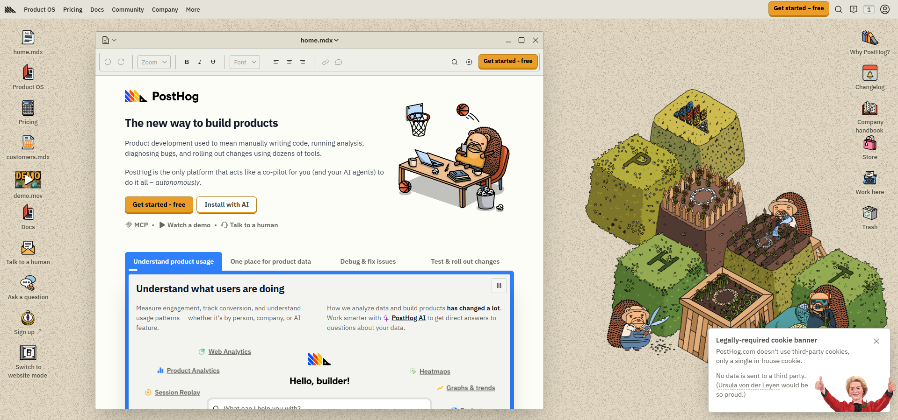
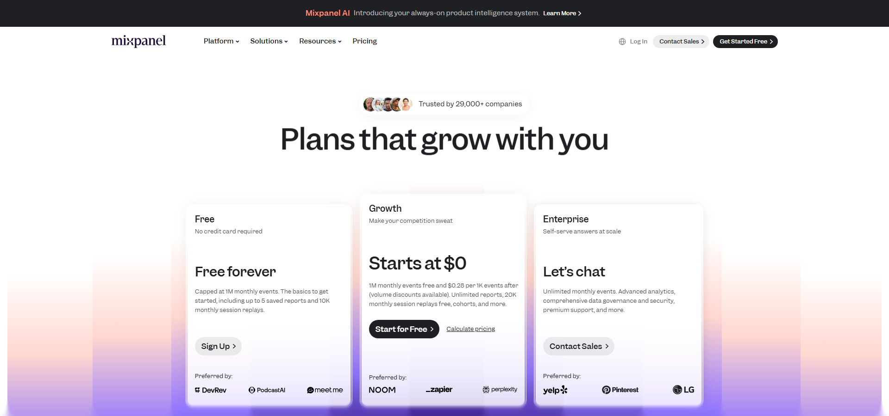
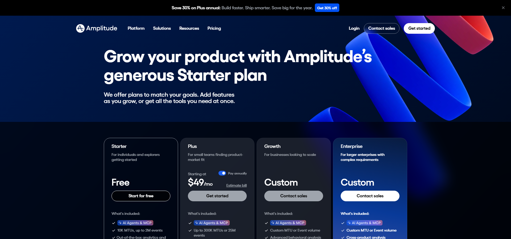
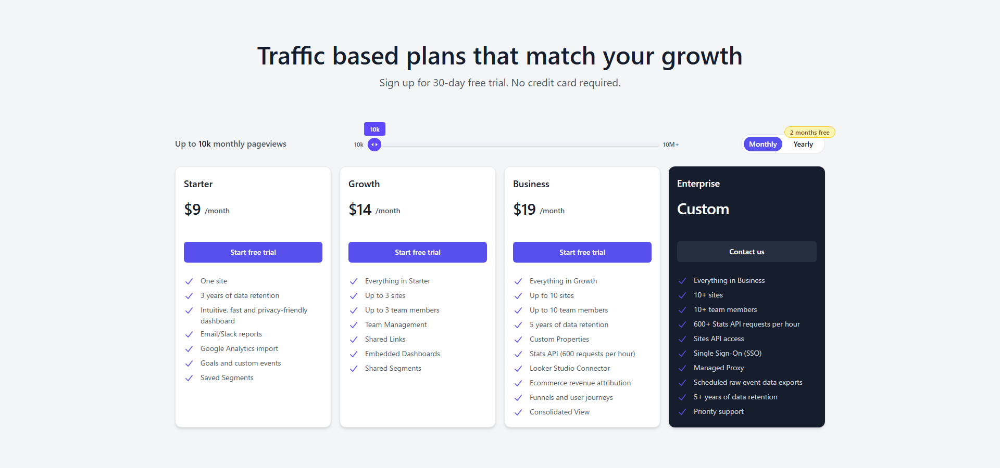
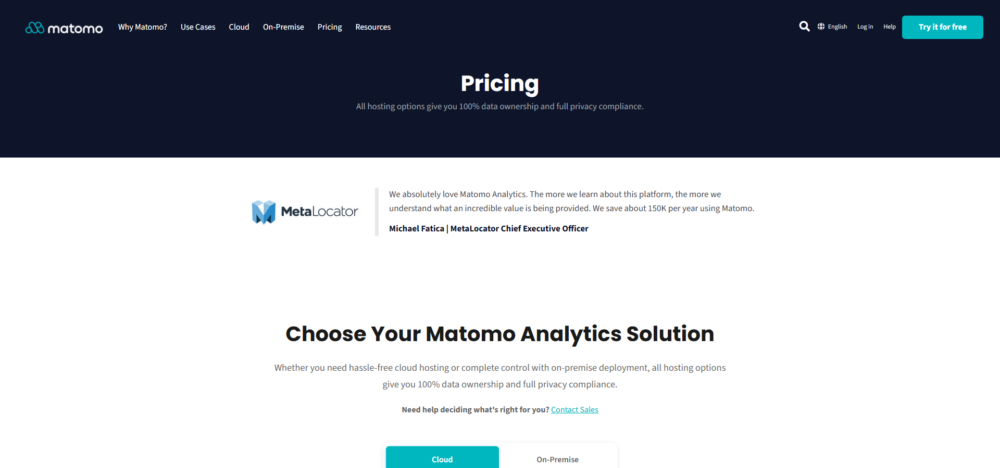

After introducing PostHog's strengths, the natural next question is: "How does it compare to the alternatives?" Let's put PostHog head-to-head with six major competitors.

The contenders:

- **PostHog** — Open-source product analytics platform
- **Google Analytics (GA4)** — Industry standard web analytics
- **Mixpanel** — Veteran product analytics
- **Amplitude** — Enterprise product analytics
- **Plausible** — Privacy-first lightweight analytics
- **Matomo** — Self-hosted open-source analytics

## Pricing Comparison

| Service | Free Tier | Paid Plan (entry) | Self-Host |
|---------|-----------|------------------|-----------|
| **PostHog** | 1M events/mo free | Pay-as-you-go | ✅ (MIT license) |
| **GA4** | Unlimited (effectively free) | Enterprise only | ❌ |
| **Mixpanel** | 1M events/mo free | Growth $0.28/1K events | ❌ |
| **Amplitude** | 10K MTU / 2M events | Plus $49/mo〜 | ❌ |
| **Plausible** | 30-day trial only | $9/mo (10K pageviews〜) | ✅ (AGPL) |
| **Matomo** | Unlimited (On-Premise Community) | Cloud €29/mo (50K hits〜) | ✅ (GPL) |

:::note
PostHog's 1M free events pool is shared across all projects. Upgrading to Pay-as-you-go unlocks up to 6 projects.
:::

## A/B Testing

| Service | A/B Testing | Notes |
|---------|------------|-------|
| **PostHog** | ✅ Built-in | Integrated with feature flags, code-based implementation |
| **GA4** | ❌ Not available | Google Optimize discontinued, need separate tool |
| **Mixpanel** | ⚠️ Add-on | Experiments available at extra cost |
| **Amplitude** | ✅ Web Experimentation | Included in Plus and above |
| **Plausible** | ❌ | Simple pageview analytics only |
| **Matomo** | ✅ Enterprise plan + | Premium plugin required |

:::conclusion
PostHog is the only service that includes A/B testing at no additional cost, deeply integrated with feature flags.
:::

:::note
PostHog's A/B testing also pairs incredibly well with AI coding agents. Just tell your agent "A/B test the text size on this button" in natural language, and it will handle feature flag setup, code implementation, and statistical analysis. All you do is decide what to test.
:::

## Session Replay

| Service | Session Replay | Free Tier |
|---------|---------------|-----------|
| **PostHog** | ✅ Built-in | 5K recordings/mo free |
| **GA4** | ❌ | None |
| **Mixpanel** | ✅ | 10K recordings (Free), 20K (Growth) |
| **Amplitude** | ✅ | 1K recordings (Starter) |
| **Plausible** | ❌ | None |
| **Matomo** | ✅ Heatmap & Session Recording | Paid plugin (Cloud/On-Premise) |

## Self-Hosting & Data Ownership

| Service | Self-Host | License |
|---------|----------|---------|
| **PostHog** | ✅ | MIT (fully open-source) |
| **GA4** | ❌ | Closed source |
| **Mixpanel** | ❌ | Closed source |
| **Amplitude** | ❌ | Closed source |
| **Plausible** | ✅ | AGPL |
| **Matomo** | ✅ | GPL |

## Feature Flags

| Service | Feature Flags |
|---------|--------------|
| **PostHog** | ✅ Built-in (1M requests/mo free) |
| **GA4** | ❌ |
| **Mixpanel** | ⚠️ Add-on |
| **Amplitude** | ✅ Unlimited (all plans) |
| **Plausible** | ❌ |
| **Matomo** | ❌ |

## Privacy / GDPR

| Service | Privacy | Cookie-Free | EU Hosting |
|---------|---------|------------|------------|
| **PostHog** | Full control via self-host | ⚠️ SaaS uses cookies | Frankfurt/US |
| **GA4** | Google-dependent | ❌ | ❌ |
| **Mixpanel** | Vendor-dependent | ❌ | Optional |
| **Amplitude** | Vendor-dependent | ❌ | Optional |
| **Plausible** | ✅ Privacy by design | ✅ No cookies | ✅ EU only |
| **Matomo** | ✅ Full control via self-host | ⚠️ Configurable | Optional |

## Which Service Should You Choose?

### Choose PostHog if you
- Want integrated product analytics, A/B testing, and feature flags
- Need a generous free tier that scales with you
- May want to self-host in the future
- **Want A/B testing without extra costs**

### Choose Google Analytics if you
- Are already invested in GA4
- Need Google Ads integration
- Only need basic web analytics

### Choose Mixpanel / Amplitude if you
- Need enterprise-grade advanced analytics
- Handle massive datasets
- Already invested in their ecosystem

### Choose Plausible if you
- Want simple, privacy-friendly analytics
- Want to remove cookie banners
- Only need traffic data for a blog or small site

### Choose Matomo if you
- Require full data ownership
- Operate in regulated industries (healthcare, finance)
- Want a mature OSS ecosystem

:::conclusion
**If you want A/B testing, feature flags, and session replay at no extra cost, PostHog is the clear winner.** Its free tier (1M events) is the most generous, and Pay-as-you-go lets you manage up to 6 projects. For teams looking for a true Product OS rather than just pageview analytics, PostHog is the strongest recommendation.
:::

Related:
- [PostHog: 1M Free Events, A/B Testing, Session Replay, and Self-Hosting](https://www.zidooka.com/archives/4447)
- [Let AI Agents Handle A/B Test Implementation and Analysis](https://www.zidooka.com/archives/4463)

### Sources

Pricing pages as of June 2026:
- PostHog: https://posthog.com/pricing
- Google Analytics: https://marketingplatform.google.com/about/analytics/
- Mixpanel: https://mixpanel.com/pricing/
- Amplitude: https://amplitude.com/pricing
- Plausible: https://plausible.io/#pricing
- Matomo: https://matomo.org/pricing/
