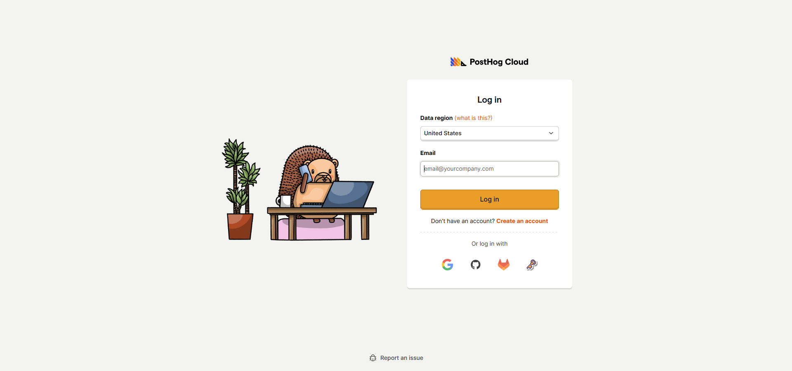

## PostHog、まだ機能あった

これまでPostHogのプロダクトアナリティクス・A/Bテスト・セッションリプレイについて紹介してきました。が、PostHogにはまだ見落としている機能が2つあります。

それが **Error Tracking** と **Surveys（アンケート）** です。

## Error Tracking ─ エラーをセッションと紐づける

PostHogのError Trackingは、フロントエンドのJavaScriptエラーを自動収集します。

設定は `posthog-js` のinitに `capture_exceptions: true` を追加するだけ。

```js
posthog.init('YOUR_KEY', {
  ...
  capture_exceptions: true, // ← これを追加
});
```

これだけで、未処理のJSエラーがすべてPostHogに飛びます。さらにReactのError Boundaryを仕込めば、キャッチしたエラーも `$exception` イベントとして送信可能。

:::note
Error Trackingの無料枠は月10万件。個人開発レベルではまず超えません。PostHog Cloudなら設定だけで即座に使えます。
:::



### 何が嬉しいか

エラー監視ツールはSentryが有名ですが、PostHogを使っているなら別途Sentryを入れる必要がありません。**同じダッシュボードで**エラー一覧・集計・セッションリプレイの紐づけが完結します。

たとえば：
- 「このエラーが出たユーザー、直前にどんな操作をしてた？」
- 「このエラー、今月どのくらい発生してる？」
- 「どのブラウザ/OSで多い？」

これがPostHogだけで全部見えます。

## Surveys ─ ユーザーに直接聞ける

PostHog Surveysを使うと、サイト上にアンケートを表示できます。コードを追加する必要はありません。PostHogのダッシュボードでアンケートを作成するだけで、`posthog-js` が自動で表示してくれます。


### 設定方法

1. PostHogダッシュボード → Surveys → New Survey
2. 質問タイプを選択（選択式・評価・自由記述など）
3. 表示条件を設定（URL・ユーザープロパティ・ロールアウト率）
4. 公開

たったこれだけで、指定したページにアンケートがポップアップ表示されます。

:::note
Surveysの無料枠は月1,500件の回答。小〜中規模サイトなら十分すぎます。
:::

## まとめ

PostHogのError TrackingとSurveysは、追加のツールを入れずにPostHogだけで完結するのが最大のメリットです。

- **Error Tracking**: コード1行でJSエラーを収集。Sentry不要に。
- **Surveys**: ノーコードでアンケート設置。ユーザーインサイトを直接取得。

:::conclusion
プロダクトアナリティクス・A/Bテスト・セッションリプレイ・Error Tracking・Surveys。これだけの機能が月100万イベント無料で使えるPostHogは、個人開発者にとって現時点で最強の選択肢です。
:::

関連記事：
- [PostHogがすごい ─ 1Mイベント無料＋A/Bテスト＋セルフホスト](https://www.zidooka.com/archives/4444)
- [PostHog vs 競合サービス比較 ─ A/Bテスト・料金・機能を徹底比較](https://www.zidooka.com/archives/4476)
