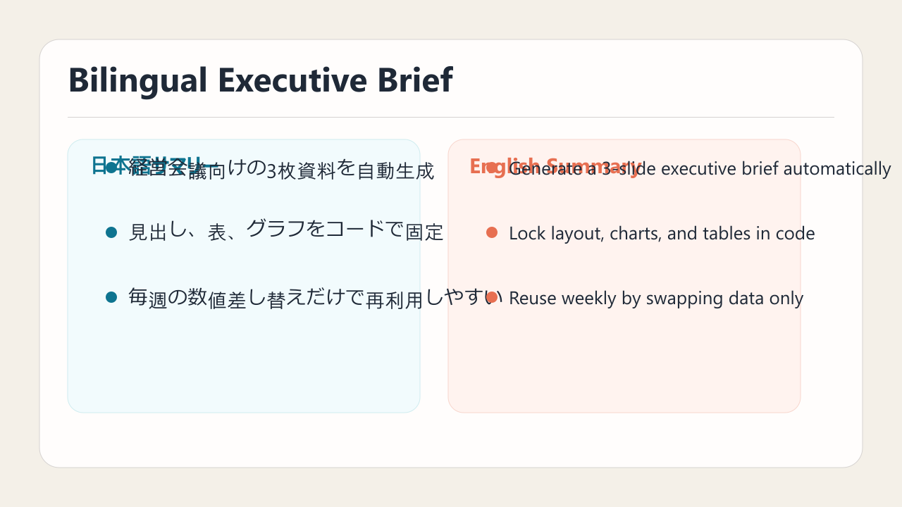
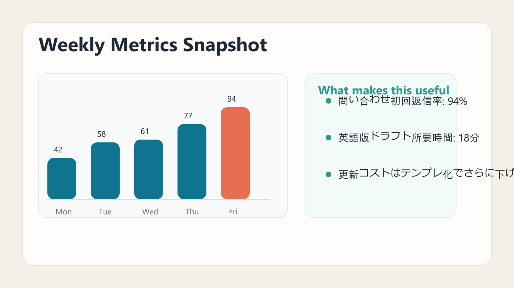

PptxGenJS looks much more practical than I expected. There are several libraries that can write PowerPoint files from code, but this one feels closer to **real working slides**, not just a toy example that creates a title slide and stops there.

That matters if you want to pair it with agents like Codex or Claude. Once an agent can generate a Node.js script from rough bullets, tables, and metrics, you can push the workflow all the way to a `.pptx` output instead of stopping at text.

:::conclusion
PptxGenJS is especially strong when you want AI to generate not only slide copy, but also a reusable PowerPoint structure that can be produced repeatedly from code.
:::

## Why it stands out

According to the official docs, PptxGenJS works in Node.js, React, and browsers, and supports text, tables, shapes, images, charts, slide masters, and HTML-to-PowerPoint conversion. It can also export `.pptx` directly in browser contexts.

In other words, this is not only a file writer. It is much closer to a **template engine for slide production**.

:::note
If you want stable AI output, a reusable PptxGenJS template is usually safer than asking an agent to reinvent layout decisions every time.
:::

## The kind of slides it is good at generating

For this test, I added `pptxgenjs` locally and prepared a small demo flow aimed at Codex / Claude style agent usage. The images below are visual previews of that sample deck.


Slide 1 is a title slide. Once colors, spacing, ribbons, and labels are fixed in code, the agent only needs to swap the content.



Slide 2 is a bilingual brief. A **Japanese column plus English column** layout is exactly the kind of repetitive formatting work that becomes much easier when you lock the structure in code.



Slide 3 adds metrics and a chart. At that point, you are no longer auto-generating plain text. You are getting much closer to an actual deliverable deck.

## If you want Codex or Claude to build slides, this is a strong option

This is the main point.

If you simply ask an agent to “make a presentation,” it can usually draft copy and structure, but the final PowerPoint output is often inconsistent. With a PptxGenJS template in place, the agent’s job becomes much clearer and more reliable.

A practical split looks like this:

1. Ask the AI for the slide outline
2. Ask for titles, bullets, and table/chart data in JSON
3. Feed that JSON into a PptxGenJS script to generate `.pptx`

:::step
Separate “thinking about the content” from “rendering the deck without breaking the layout.” That separation makes AI-driven slide workflows much more stable.
:::

This is especially useful for weekly reports, sales decks, management summaries, status updates, and event overviews. Fixing the slide skeleton in code is usually safer than asking the model to design everything from scratch every time.

## The official feature set is very business-friendly

The docs highlight several features that fit real workflows well:

- Text, tables, shapes, images, and charts
- Slide Masters for shared branding
- `tableToSlides()` for converting HTML tables into one or more slides
- `.pptx` output in both browser and Node.js environments
- Compatibility with Node.js, React, Vite, Electron, and serverless setups

:::example
If your app or dashboard already renders an HTML table, `tableToSlides()` is a very direct path to “Export to PowerPoint.”
:::

## How to prompt an AI agent for this

You will usually get better results if the prompt is structured.

```text
Generate a 16:9 PowerPoint in PptxGenJS from this JSON.
- 3 slides
- Japanese titles, English supporting text
- teal-based palette
- slide 2 uses a bilingual two-column layout
- slide 3 includes a bar chart and a takeaway card
- output as .pptx
```

Once layout rules are explicit, both Codex and Claude tend to produce more stable code.

## There are still limits

This is not magic.

:::warning
Installing PptxGenJS does not automatically make AI produce beautiful slides. You still get better results if a human defines the template, palette, spacing, and component sizing up front.
:::

If you need highly polished illustration work or animation-heavy presentations, you will still need more manual control. But for **repeatable structured business slides**, this is a very solid direction.

## Conclusion

PptxGenJS makes the most sense when you treat it not just as a JavaScript library for PowerPoint, but as a **slide-template layer for the AI era**.

If you want Codex or Claude to produce real decks instead of stopping at draft text, adding PptxGenJS between the model output and the final presentation is a very practical move.

If you are wondering what to standardize on for AI-assisted PowerPoint generation, this is a strong candidate.

## References

1. PptxGenJS Home
https://gitbrent.github.io/PptxGenJS/
2. PptxGenJS Introduction
https://gitbrent.github.io/PptxGenJS/docs/introduction/
3. PptxGenJS HTML to PowerPoint
https://gitbrent.github.io/PptxGenJS/docs/html-to-powerpoint/
4. PptxGenJS Masters and Placeholders
https://gitbrent.github.io/PptxGenJS/docs/masters.html
5. PptxGenJS Charts
https://gitbrent.github.io/PptxGenJS/docs/api-charts.html
