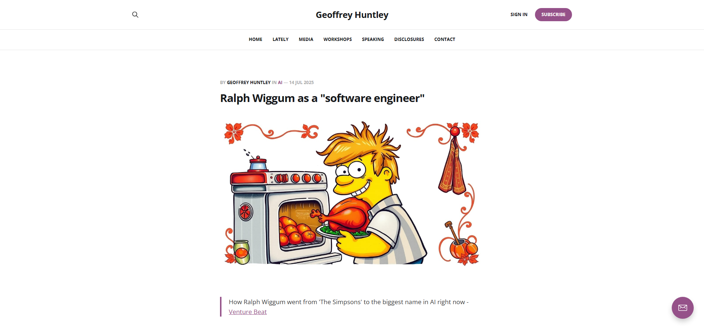
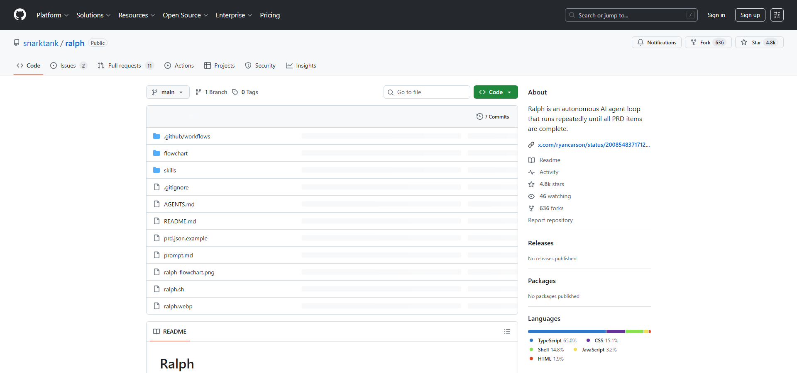

AIにコードを書かせる時代になりましたが、「一発で完成させる」というアプローチには限界があります。AIは文脈を忘れ、指示を取り違え、時に暴走します。

この問題に対する一つの解として注目されているのが **Ralph Driven Development（RDD）** です。

【結論】Ralph とは「AIを1タスクずつ実行させ、gitで管理しながら反復させる開発手法」です。

## Ralph とは何か



Ralph（ラルフ）は、AIコーディングエージェントを **ループで実行** し、タスクが完了するまで反復させる開発手法です。名前の由来はシンプソンズのキャラクター「Ralph Wiggum」から来ています。

最も純粋な形では、Ralph は以下のような Bash ループで表現されます：

```bash
while :; do cat PROMPT.md | claude-code ; done
```

これだけ見ると単純に見えますが、この「無限ループ」こそが Ralph の本質です。

## なぜ Ralph が必要なのか

従来のAIコーディングには以下の問題があります：

- **文脈の喪失**: 長い会話の中でAIが「話を忘れる」
- **一括処理の脆弱性**: 大きなタスクを一度に任せると、途中で破綻する
- **追跡困難**: どこまでAIが何をやったのか分からない
- **手戻りの難しさ**: 問題が発生した時に、どこまで戻せばいいか不明

Ralph はこれらの問題を **構造で解決** します。

## Ralph の基本ループ

Ralph の動作は極めてシンプルです：

1. **Plan（計画）ファイルを読む** - `plan.md` などのタスクリスト
2. **1つのタスクを選ぶ** - 未完了のタスクから1つだけ
3. **実装する** - そのタスクのみを完了させる
4. **git commit する** - 変更をバージョン管理に記録
5. **繰り返す** - 全タスク完了まで1-4を反復

【ポイント】AIは「1タスク = 1コミット」で動作します。これにより、失敗時の切り戻しが容易になります。

## 文脈は git で管理する

Ralph の革新的な点は、**AIの記憶をモデルのコンテキストに頼らない** ことです。

従来のAIチャットでは、会話履歴がモデルの文脈となります。しかしこれには限界があります。Ralph では以下のように記憶を外部化します：

- **git 履歴**: 過去のコミットが「何をやったか」の記録
- **progress.txt**: 各イテレーションでの学びを追記
- **AGENTS.md**: 運用上の知見を蓄積

つまり、毎回のループは **新鮮なコンテキスト** で始まり、必要な情報はファイルから読み込みます。

## opencode-ralph: OpenCode での実装


[opencode-ralph](https://github.com/hona/opencode-ralph) は、Ralph を OpenCode SDK と OpenTUI を使って実装したプロジェクトです。

### インストール

```bash
# Bun を使ってグローバルインストール
bun install -g @hona/ralph-cli

# 任意のプロジェクトディレクトリで実行
ralph
```

### 主な機能

| オプション | デフォルト | 説明 |
|-----------|----------|------|
| `--plan, -p` | `plan.md` | 計画ファイルのパス |
| `--model, -m` | `opencode/claude-opus-4-5` | 使用するモデル |
| `--reset, -r` | `false` | 状態をリセット |

### 操作キー

- `p` キー: 一時停止 / 再開
- `q` または `Ctrl+C`: 終了

## snarktank/ralph: 元祖実装



[snarktank/ralph](https://github.com/snarktank/ralph) は、Amp CLI を使った Ralph の実装で、4,800 以上のスターを獲得している人気プロジェクトです。

こちらは PRD（Product Requirement Document）形式のタスク管理を採用しており、JSON 形式で各タスクの完了状態を追跡します。

### 基本的なワークフロー

1. PRD を作成（Markdown形式）
2. Ralph スキルで JSON に変換
3. `./scripts/ralph/ralph.sh` を実行
4. 全タスク完了まで自動ループ

## plan.md の書き方

Ralph の成否は **計画ファイルの質** に大きく左右されます。

```markdown
# Project Plan

## Phase 1: Setup
- [ ] Initialize project with bun init
- [ ] Add TypeScript configuration
- [ ] Create src/index.ts entry point

## Phase 2: Core Features
- [ ] Implement user authentication
- [ ] Add database connection
```

【注意】タスクは小さく、独立させてください。「認証機能を追加」ではなく「ログインフォームを作成」「パスワード検証を実装」のように分解します。

### 計画ファイルのガイドライン

- 1タスク = 1コミットで完結できるサイズに
- 依存関係を考慮して順序を決める
- `- [ ]` 形式のチェックボックスを使用
- 詳細であるほど良い（1000行以上も珍しくない）

## AGENTS.md の役割

Ralph は失敗から学びます。その学びを記録するのが `AGENTS.md` です。

```markdown
# AGENTS.md

## Build
- Run `bun install` before `bun run dev`

## Pitfalls
- Never import from `solid-js`, use `@opentui/solid`
```

Ralph が何かを間違えたら、そこに「標識」を立てます。次のイテレーションではその標識を読み、同じ過ちを避けます。

【対処】Ralph が同じミスを繰り返す場合は、AGENTS.md に明示的なルールを追記してください。

## 誰に向いているか

Ralph は万人向けではありません。

**向いている人:**
- git を前提に開発している
- AIの「一発回答」に不信感がある
- タスク管理と履歴を重視する
- エージェント型AIを本格的に導入したい

**向いていない人:**
- とにかく早く完成品が欲しい
- git の運用がよく分からない
- 小刻みな作業がストレス

## Ralph が示すもの

Ralph は「AIが賢くなる未来」を語っていません。むしろ逆です。

> AIは忘れる。だから人間側が構造を設計する必要がある。

これは極めて現実的な立場です。AIの弱点（文脈喪失・暴走）を、ツールではなく **構造で封じ込める** という思想です。

:::conclusion
Ralph Driven Development は、AIエージェントを「信頼できる作業員」として扱うためのフレームワークです。OpenCode や Amp などのツールと組み合わせることで、反復的かつ追跡可能な自動開発が可能になります。
:::

## 参考リンク

- [Geoffrey Huntley - Ralph Wiggum as a "software engineer"](https://ghuntley.com/ralph/)
- [opencode-ralph (GitHub)](https://github.com/hona/opencode-ralph)
- [snarktank/ralph (GitHub)](https://github.com/snarktank/ralph)
- [Luke Parker - Stop Chatting with AI, Start Loops](https://lukeparker.dev/stop-chatting-with-ai-start-loops-ralph-driven-development)
