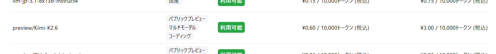

I registered for Sakura AI-ENGINE (さくらのAI-ENGINE) to give it a try.

The sign-up process only requires a credit card. No complex verification or paperwork — if you already have a Sakura Internet account, you can get started immediately.

## Kimi K2.6 Is Available

The highlight: **Kimi K2.6 is available** on the platform.

Kimi K2.6 is priced around $0.95, making it a very affordable model. It's already offered on opencode-zen, and its presence on Sakura Internet's platform suggests it's gaining broad distribution.

:::note
You can check the full list of available models from the Sakura AI-ENGINE dashboard. Kimi K2.6 is one of several options.
:::

## Who Is This For

- Existing Sakura Internet users
- Anyone who wants a simple credit-card-based way to access AI models
- Developers looking to try Kimi K2.6 at low cost

The simplicity of credit-card sign-up makes it arguably easier than setting up an OpenAI or Anthropic account.
