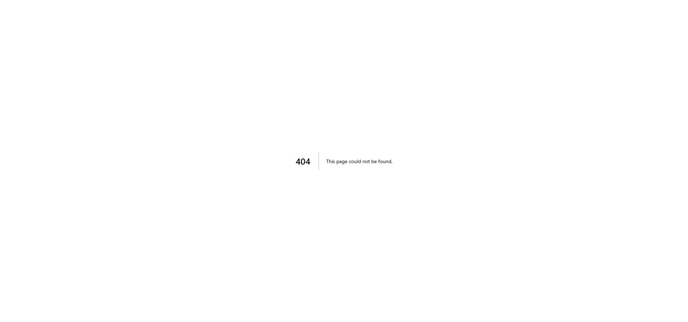

# 大安とは？意味・由来・やってはいけないことまで徹底解説

「結婚式は大安がいい」「納車は大安に合わせたい」――日本で暮らしていると、こうした会話を一度は耳にしたことがあるのではないでしょうか。大安は日本で最もよく知られた吉日ですが、その意味や由来をきちんと説明できる方は意外と少ないかもしれません。

この記事では、大安の意味や、大安にやると良いこと・避けるべきことを整理し、実際に大安の日を調べる方法までまとめてご紹介します。

## 大安は六曜のひとつ

大安は**六曜（ろくよう）**と呼ばれる暦注のひとつです。六曜には「先勝・友引・先負・仏滅・大安・赤口」の6種類があり、それぞれの日に吉凶の意味が割り当てられています。

大安の読みは「たいあん」で、「大いに安し」という意味を持ちます。一日を通して吉とされるのが大きな特徴です。先勝は午前中だけが吉、赤口は正午前後だけが吉といった時間帯の制限がありますが、大安にはそれがありません。終日、何をするにも良い日とされています。

## 大安に行われることが多いイベント

大安は「万事に良い日」とされるため、人生の節目となるイベントに選ばれることが多いです。代表的なものを挙げてみます。

- **結婚式・入籍** -- 式場の予約が集中しやすく、大安の土日は早めに埋まる傾向があります
- **引越し** -- 新生活のスタートを縁起よく切りたいという方に人気です
- **開業・起業** -- 事業の門出に大安を選ぶ経営者も少なくありません
- **納車** -- ディーラーに「大安に届けてほしい」と依頼するケースは非常に多いです
- **契約・届出** -- 不動産契約や各種届出にも好まれます

## 大安にやってはいけないことはある？

結論から言えば、大安にやってはいけないことは基本的にありません。終日が吉日なので、時間帯を気にする必要もなく、安心してどんな予定でも入れられます。

:::warning
ただし、**不成就日（ふじょうじゅび）**という別の暦注と重なる場合は注意が必要です。不成就日は「何事も成就しない日」とされており、大安と重なると吉日の効果が打ち消されると考える方もいます。気になる方は、大安だけでなく不成就日も併せてチェックしておくと安心です。
:::

## 大安の日をカレンダーで調べる方法

大安がいつなのかを手軽に確認したい場合は、ZIDOOKAの吉日カレンダーが便利です。

:::step
1. 吉日カレンダー（<https://tools.zidooka.com/jp/calendar>）にアクセスします
2. カレンダー上の各日付に六曜が表示されているので、「大安」と書かれた日を確認します
3. 大安の詳しい意味を知りたい場合は、大安の解説ページ（<https://tools.zidooka.com/jp/calendar/taian>）も参考になります
:::

カレンダーでは大安以外の六曜も一覧で確認できるため、友引や仏滅を避けたいといった場面でも役立ちます。

:::conclusion
大安は六曜の中で最も縁起が良いとされる日で、結婚式や引越し、開業などの大切なイベントに広く選ばれています。一日中吉とされるため、時間帯を気にせず予定を立てられるのも大きなメリットです。とはいえ、大安でなければいけないと気負いすぎる必要はありません。あくまで「良い日を選べたらラッキー」くらいの気持ちで、吉日カレンダーを活用してみてください。
:::

---

**参考**

1. 吉日カレンダー - 大安の解説
<https://tools.zidooka.com/jp/calendar/taian>

2. 吉日カレンダー
<https://tools.zidooka.com/jp/calendar>
