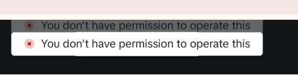

2025年12月23日、TikTok広告管理画面にアクセスしたところ、以下のエラーメッセージが突然表示され、その直後に強制的にログアウトされる事象が発生しました。

`You don't have permission to operate this`

単なる警告表示ではなく、**操作不能 → セッション切断（ログアウト）** まで一気に進む挙動であり、ユーザー側では何も操作していない状態でした。この記事では、実際に発生したこのエラーの状況と、考えられる原因・対処法を整理します。

## 発生条件（今回のエラー報告）

今回このエラーが確認された環境・条件は、以下の通りです。

*   **発生日**：2025年12月23日
*   **OS**：Windows 10
*   **アクセスURL**：`https://ads.tiktok.com/i18n/manage/`
*   **利用環境**：PCブラウザ（通常ログイン状態）
*   **操作内容**：広告管理画面を閲覧中（新規作成・編集操作なし）
*   **発生結果**：エラーメッセージ表示 → 直後に強制ログアウト

この時点で、パスワード変更・権限変更・ログイン切替などは行っていません。

## このエラーの性質（体験ベースの整理）

今回の挙動から、このエラーは単純な「操作権限がありません」系のUIエラーではないと考えられます。

*   **通常の権限不足エラー**：操作がブロックされるだけで、ログアウトまでは起きない
*   **今回の事例**：権限エラー表示と同時にセッション自体が破棄されている

つまり、**権限チェックの失敗をきっかけに、TikTok側でログインセッションが無効化された** 可能性が高い挙動です。

## 考えられる原因

今回の条件から、考えられる原因は主に以下の系統に分かれます。

:::warning
**1. 広告アカウントとログインアカウントの権限不整合**
広告アカウントは存在するが、現在ログインしているユーザーが Business Center 管理者ではない、もしくは権限が変更・剥奪された状態です。この場合、画面読み込み時の権限検証でエラーが発生し、「操作不可」→「セッション終了」という流れになることがあります。
:::

:::warning
**2. TikTok Ads 側の権限再評価タイミングに起因する問題**
TikTok広告管理画面では、画面表示時に「ユーザー権限の再評価」「広告アカウントとの紐付け確認」などが裏で行われています。このいずれかで不整合が検出された場合、安全側に倒して強制ログアウトする挙動になる可能性があります。
:::

:::warning
**3. セッション／キャッシュ情報の破損**
Windows 10 + ブラウザ環境では、古いログインセッションや権限変更前のキャッシュが残っていると、「権限がある前提のセッション」＋「実際には権限がない」という矛盾が発生しやすくなります。
:::

## 同様の事象が起きた場合の現実的な対処

今回のような挙動が出た場合、やるべきことは次の順です。

:::step
**対処① 再ログインを試す**

まずは同じアカウントで再ログインを試してください。一時的なセッション切れであればこれで直ります。
:::

:::step
**対処② 権限と紐付けの確認**

広告アカウントが存在しているか、Business Center 上で「自分の権限」と「広告アカウントとの紐付け」が正しいかを確認します。
:::

:::step
**対処③ 別環境での確認**

別ブラウザや別端末（スマホアプリ等）で同じURLにアクセスして再現するか確認してください。特定のブラウザキャッシュが原因であれば、これで切り分けができます。
:::

## まとめ

このエラーで注意すべき点は、次の2点です。

*   ❌ 「自分が何か誤操作したから出たエラー」ではない
*   ❌ 「一時的な表示バグ」でもない可能性が高い

むしろ、TikTok側の権限判定ロジックやセッション管理が絡んだ、構造的に起きるエラーと考えたほうが自然です。「待てば直る」系ではないケースも多いため、権限構造を一度きちんと確認することをお勧めします。
