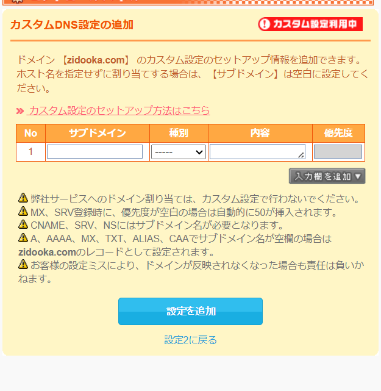
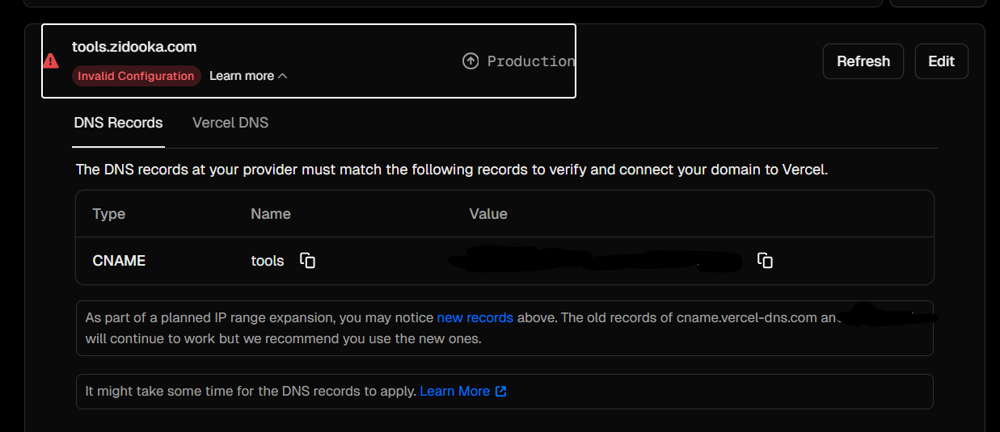

Vercelで独自ドメイン（サブドメイン）を設定する際、DNS設定が正しいはずなのに `Invalid Configuration` エラーが消えないトラブルに遭遇しました。
特に「ムームードメイン」を使用している場合に発生しやすい罠があったため、その解決方法を共有します。

## 発生した問題

VercelのProject Settings > Domains からサブドメイン（例: `tools.zidooka.com`）を追加しました。
Vercel側から提示されたDNSレコード（CNAME）をドメイン管理会社側で設定しましたが、数十分待ってもVercelのステータスが `Invalid Configuration` のまま変わりません。

## 環境

- **Hosting:** Vercel (Hobby Plan)
- **Domain Registrar:** ムームードメイン
- **DNS:** ムームーDNS（カスタム設定）

## 原因：CNAMEレコードの末尾のドット

原因は、ムームーDNSの「カスタム設定」における**CNAMEレコードの記述形式**にありました。

通常、DNSのCNAMEレコードでは、値（Value）の末尾にルートを表すドット（`.`）を付けるのが正式な記法とされることが多いです（例: `cname.vercel-dns.com.`）。
しかし、**ムームーDNSのセットアップ画面では、末尾にドットを付けるとエラー、または不正な値として扱われてしまいます。**

:::warning
**注意:**
ムームーDNSは内部的に末尾のドットを自動補完する仕様のようです。ユーザーが手動で入力する必要はありません。
:::

## 解決手順

ムームードメインのコントロールパネルから、DNSレコードを修正します。

:::step
**Step 1: ムームーDNS設定画面を開く**
ドメイン操作 > ムームーDNS > 利用中のドメインの「変更」ボタンをクリックし、「カスタム設定」のセットアップ情報変更画面を開きます。
:::

:::step
**Step 2: CNAMEレコードを修正する**
Vercel用のレコードを以下のように入力（または修正）します。

| 項目 | 設定値 | 備考 |
| --- | --- | --- |
| サブドメイン | `tools` | 設定したいサブドメイン名 |
| 種別 | `CNAME` | |
| 内容 | `cname.vercel-dns.com` | **末尾のドット（.）は削除する** |

:::

:::step
**Step 3: 設定を保存して待機**
「設定を追加」または「設定変更」をクリックして保存します。
DNSの伝搬には数分〜数十分かかります。
:::

:::step
**Step 4: Vercel側で確認**
VercelのDomains画面に戻り、該当ドメインの `Refresh` ボタンを押します。
設定が正しければ、ステータスが `Valid Configuration` に変わり、SSL証明書が発行されます。
:::

## まとめ

Vercelに限らず、ムームードメインでCNAMEを設定する際は「末尾のドットは不要」と覚えておくと、同様のトラブルを回避できます。

:::note
もし設定後30分以上経過しても反映されない場合は、不要なAレコードが残っていないか、CNAMEレコードが重複していないかも併せて確認してください。
:::
