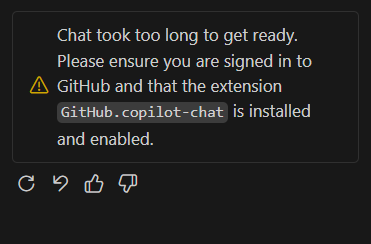

VS Code を起動してすぐに GitHub Copilot Chat を開いたところ、「Chat took too long to get ready」というエラー表示が出た。

一瞬、認証や拡張機能の不具合を疑ったが、特に何もせずそのまま待っていたところ、数十秒〜1分ほどで Copilot Chat が通常どおり利用可能になった。

【結論】VS Code 起動直後は Copilot Chat の初期化が未完了のため、少し待てば自然に解消する。

## 発生した状況

- VS Code 起動直後に Copilot Chat を開いた
- 「Chat took too long to get ready」というエラーメッセージが表示された
- 認証や拡張機能の問題を疑った

## 解決までの流れ

結果的には、以下のような状態だっただけだった：

1. VS Code 起動直後
2. Copilot Chat の初期化がまだ終わっていない状態
3. その状態でアクセスしたため一時的にエラー表示

数十秒〜1分ほど待機したところ、特に何も操作しなくても Copilot Chat が通常どおり利用可能になった。

## 対処方法

【対処】起動直後であれば慌てて設定や再インストールを行わず、少し待ってから再度開く。

同様のエラーが表示された場合：

:::step
1. そのまま少し待つ（30秒〜1分程度）
2. 再度 Copilot Chat を開いてみる
3. それでも解消しない場合は、VS Code を再起動する
:::

今回のケースでは、時間を置くだけで解決した。

## まとめ

VS Code の Copilot Chat で「Chat took too long to get ready」というエラーが表示されても、起動直後であれば初期化待ちの可能性が高い。

【注意】慌てて設定を変更したり拡張機能を再インストールする前に、まずは少し待ってみる。

それでも解消しない場合は、認証状態や拡張機能のバージョンを確認するとよい。

今回はそれだけの話。
