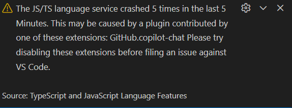

# 突然のエラー通知

こんにちは、ZIDOOKAです。
VS Codeで作業をしていたら、右下に黄色い警告が表示されました。

> The JS/TS language service crashed 5 times in the last 5 Minutes.
> This may be caused by a plugin contributed by one of these extensions: GitHub.copilot-chat

「JS/TS言語サービスが直近5分で5回クラッシュしました。GitHub Copilot Chatが原因かもしれません」とのこと。

## 何が起きているのか

調べてみると、これはVS Codeの裏で動いている **tsserver (TypeScript and JavaScript Language Features)** が落ちている状態のようです。
VS Code本体が壊れたわけではなく、コード補完や型チェックを行うプロセスが過負荷などでダウンしたことを示しています。

原因として考えられるのは：
1.  **GitHub Copilot Chatの負荷**: プロジェクト全体やnode_modulesを読みに行き過ぎている。
2.  **プロジェクト構成**: node_modulesが肥大化していたり、tsconfigの範囲が広すぎる。

## 今回の対応：放置

警告は出ましたが、現状を確認してみると：

*   エディタの操作は重くない
*   CLIツールの実行は問題なし
*   ビルドも通る

**実害が全くありません。**

エラーメッセージは不穏ですが、機能的に問題が生じていないため、今回は**「様子見（放置）」**することにしました。
この手のエラーは一時的なもので、放っておくと出なくなることも多いです。

## もし実害が出たら

もし補完が効かなくなったり、動作が重くなったりした場合は、以下の手順を試す予定です。

1.  **GitHub Copilot Chatを一時的に無効化する**
2.  **TS Serverを再起動する** (コマンドパレットから `TypeScript: Restart TS Server`)

とりあえず動いているなら、深追いせずに作業を進めるのが吉ですね。

https://zidooka.com/
