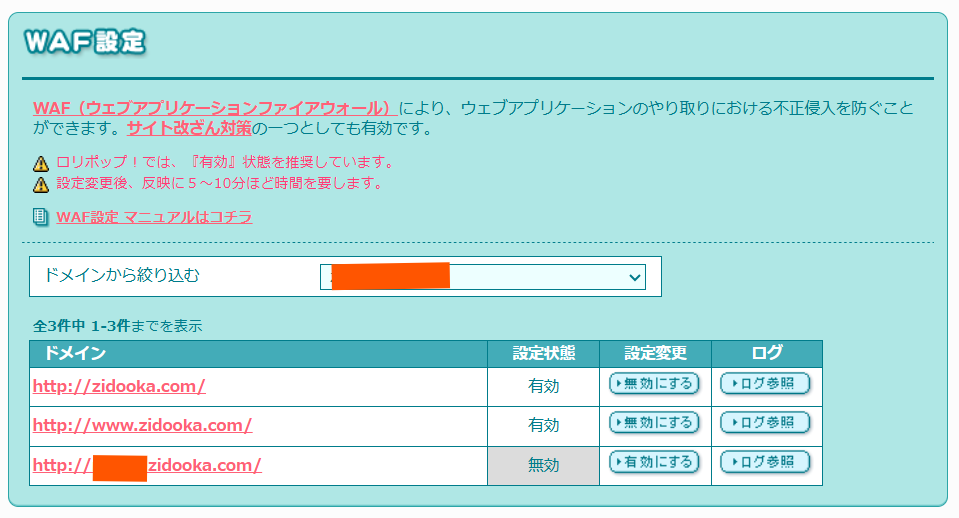

# Keep WAF Enabled While Using the API

Hello, this is ZIDOOKA.
When uploading images using the WordPress REST API, you often encounter `403 Forbidden` errors caused by the **WAF (Web Application Firewall)**.

While it's well known that "disabling the WAF fixes it," disabling the WAF on your main site is a security risk that most of us want to avoid.

Today, I'll share a technique to **"keep the main site's WAF enabled while successfully uploading images via API,"** balancing both security and convenience.

## The Solution: A Dedicated API Subdomain

The conclusion is simple: I created a **"subdomain dedicated to API usage (image uploads)."**

### How It Works
On many hosting servers (like Lolipop!), WAF settings are independent for each domain (or subdomain). We can exploit this.

1.  **Main Site (`example.com`)**:
    *   Where general users visit.
    *   **WAF: Enabled (ON)**
    *   Keeps security high.

2.  **API Subdomain (`api.example.com`)**:
    *   Where only I (my CLI tool) access.
    *   **Settings: Optimized for API**
    *   Used as the REST API endpoint.

### Implementation Steps

1.  **Create a Subdomain**:
    Create a subdomain in your server dashboard and point it to the same directory as your main site.

2.  **Change Settings**:
    Adjust the security settings for the subdomain to allow API traffic. The main site remains fully protected.

3.  **Update API Client Settings**:
    Change the connection endpoint in your CLI tool or program from the main URL to the subdomain.

    ```javascript
    // Before
    const apiUrl = 'https://example.com/wp-json';

    // After
    const apiUrl = 'https://api.example.com/wp-json';
    ```

## Security and Side Effects

You might worry that "disabling WAF = vulnerable."
However, this approach is based on the design philosophy of "limiting the attack surface."

### Further Security Enhancements
To make the API subdomain even safer, consider combining these measures:

*   **IP Restriction**: Allow access only from your home IP or CI/CD environment (e.g., GitHub Actions).
*   **Basic Auth**: Enable Basic Authentication on the web server and add headers to your API client.
*   **Least Privilege**: Grant the API user only "Author" permissions, not "Administrator."

### Side Effects to Check
*   **Media URL**: The URL of uploaded images can be either the main domain (`example.com`) or the subdomain (`api.example.com`), depending on your settings. If you care about SEO, configure WordPress to return the main domain URL or use a CDN.
*   **SSL**: Always enable SSL (HTTPS) for the subdomain as well.

## Comparison with Other Workarounds

| Method | Security | Reproducibility | Notes |
| :--- | :--- | :--- | :--- |
| **Disable WAF Globally** | × Risky | ◎ High | Not recommended. |
| **Spoof User-Agent** | △ Mixed | △ Low | May not work depending on WAF rules. |
| **Plugin Adjustment** | △ Average | △ Medium | Depends on plugin compatibility. |
| **Subdomain Separation** | **◎ Safe** | **◎ High** | **Clear configuration and permanent fix.** |

## The Result

This creates an ideal environment:

*   **Attacks on the Web**: Blocked by the main site's WAF.
*   **API Uploads**: Succeed via the subdomain, bypassing the WAF restrictions.



"Disabling WAF globally because of 403 errors" should be a last resort.
By splitting the entry point (domain), you can minimize security risks while enjoying the benefits of automation.

If you are struggling with WordPress REST API 403 errors, give this "Subdomain Strategy" a try.

https://zidooka.com/
