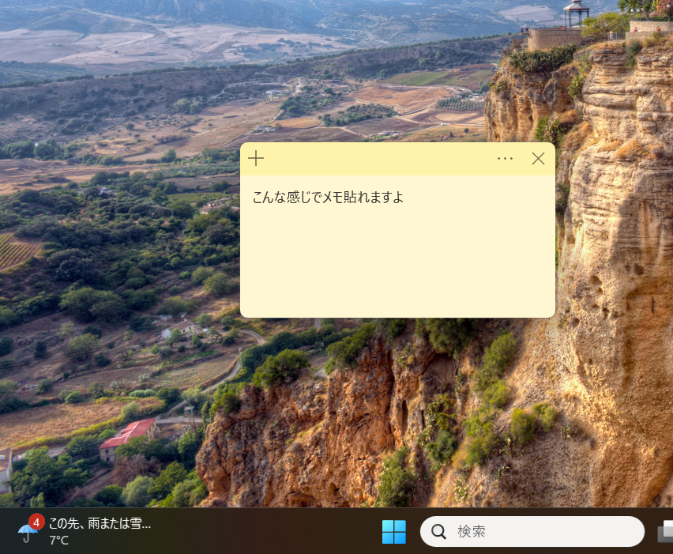
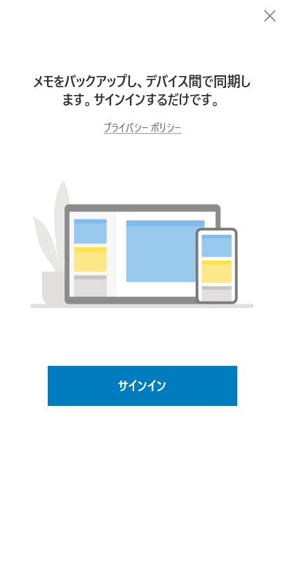

I was looking for a simple note-taking app for Windows when I decided to install the official Microsoft "Sticky Notes" from the Store.
At first, I didn't expect much—it's just sticky notes, right? But after using it for work, I was surprised by how much it **subtly but surely improved my efficiency**.

In this article, I'll organize why this native Windows app is such a productivity booster and best practices for using it.

## The Polish of a Native App

There are many note-taking apps out there, but the strength of the official Microsoft app is its **affinity with the OS**.
It launches instantly, and the UI is completely integrated into Windows' design language, so it hardly feels like you're launching a separate application.

### Lightness That Doesn't Interrupt Thought
The biggest advantage is its **lightness**. When you have an idea, trying to open a heavy notebook app (like Notion or OneNote) can often break your train of thought while waiting for it to load.

In contrast, Sticky Notes lets you start writing the moment you launch it.
It has just the right amount of features for daily use, like color coding and placing multiple notes on the desktop. You won't get lost in unnecessary settings.

## Why Sign-In Is Required

When I launched it for the first time, I was asked to sign in with my Microsoft account. Putting up a barrier just for sticky notes seemed annoying at first.

However, there is a clear benefit to this: **Cloud Synchronization**.

Once signed in, your notes are automatically synced with other Windows PCs and the "Sticky Notes" section in the OneNote app on your smartphone. You can write a note on your office PC and check it on your phone during your commute home without any configuration.

:::note
If you are already logged into Windows with a Microsoft account, authentication usually completes with just a few clicks.
:::

## Best Use Cases

Of course, it's not a silver bullet. The key is to understand its role as a "volatile memory buffer".

### ✅ Good For (Temporary Buffer)
- **Phone Memos**: Phone numbers or requirements jotted down quickly.
- **Task Staging**: A list of things to do today.
- **Temporary Clipboard**: A place to temporarily store copied text.
- **Fragments of Thought**: Brainstorming blog posts or code logic.

### ❌ Not Good For (Stock)
- **Long-term Knowledge Management**: Manuals needed a month later.
- **Structured Data**: Tables or complex hierarchies.
- **Search-heavy Usage**: Tagging and advanced search are weak.

:::step
**Recommended Workflow:**
1. Scribble into a Sticky Note as soon as you think of it.
2. Once the work segment is done, transcribe only what is necessary to Notion or Obsidian.
3. Delete the note immediately when done.
:::

It is an excellent tool for cycling through "Write -> Discard".

## Summary: Worth Installing

In conclusion, if you are a Windows user, you should install it without prejudice.

It consumes almost no resources even if left running, and the experience of **"writing before thinking"** greatly reduces daily stress, albeit subtly.
If you are tired of high-functionality tools, try returning to basics with the genuine Sticky Notes.

:::conclusion
**Key Points:**
1. Instant launch and non-intrusive UI unique to native apps.
2. Link with smartphones via cloud sync.
3. The ultimate "temporary thought buffer".
:::
