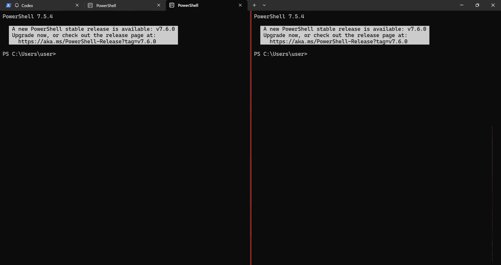

Windows Terminalはタブで増やすものだと思っていたのですが、実はペイン分割も標準で使えます。ショートカットを覚えるだけで、同じタブ内にPowerShellや別シェルを並べて見比べられるので、ちょっとした確認作業がかなり楽になります。

【結論】既定設定のままでも、`Alt+Shift++` で縦分割、`Alt+Shift+-` で横分割できます。設定変更なしでそのまま使えます。

## まず覚えるショートカット

| 操作 | 既定ショートカット | 動き |
| --- | --- | --- |
| 縦分割 | `Alt+Shift++` | 右側に新しいペインを追加 |
| 横分割 | `Alt+Shift+-` | 下側に新しいペインを追加 |
| ペイン移動 | `Alt` + 方向キー | 隣のペインへフォーカス移動 |
| ペインサイズ変更 | `Alt+Shift` + 方向キー | 選択中ペインの幅や高さを変更 |
| ペインを閉じる | `Ctrl+Shift+W` | 選択中ペインを閉じる |

【ポイント】「縦分割」「横分割」は少し紛らわしいです。公式ドキュメント上では、`縦分割 = 縦の境界線が入って右に増える`、`横分割 = 横の境界線が入って下に増える` という意味です。

## 実際の見た目

以下のように、1つのタブの中でPowerShellを左右に並べて使えます。

タブを増やすよりも、ログの比較やコマンド結果の見比べがしやすい場面があります。たとえば片方で作業ディレクトリを開いたまま、もう片方で `git status` や `npm run dev` を動かす、といった使い方です。

## どんなときに便利か

- 左で作業、右でログ確認をしたいとき
- 上でサーバー起動、下でコマンド入力をしたいとき
- 同じフォルダの別作業をタブではなく並列で見たいとき
- PowerShell と Command Prompt を同時に開いて動作差を見たいとき

同じウィンドウに収まるので、タブを行き来する回数が減ります。特に「今どちらが実行結果だったか」を見失いにくいのが地味に便利です。

## 分割をマウスでやる方法

ショートカットを忘れても、`Alt` を押しながら新しいタブボタンをクリックすれば、現在のタブを自動分割できます。キーボード操作のほうが速いですが、最初はこの方法でも十分です。

## 覚えておくとさらに快適な操作

`Alt` + 方向キーでペイン間を移動できるので、分割しただけで終わらず操作まで完結します。さらに `Alt+Shift` + 方向キーで幅を広げたり狭めたりできるため、ログ側だけ細くしておく、といった調整も簡単です。

もしショートカットを忘れた場合は、`Ctrl+Shift+P` でコマンドパレットを開くと、ペイン関連の操作をメニューから探せます。

## まとめ

:::conclusion
Windows Terminalは標準機能だけでペイン分割に対応しています。`Alt+Shift++` と `Alt+Shift+-` を覚えるだけで、タブを増やさなくても同じウィンドウ内で並行作業しやすくなります。
:::

References:
1. Panes in Windows Terminal
https://learn.microsoft.com/en-us/windows/terminal/panes
2. Command line arguments in Windows Terminal
https://learn.microsoft.com/en-us/windows/terminal/command-line-arguments
