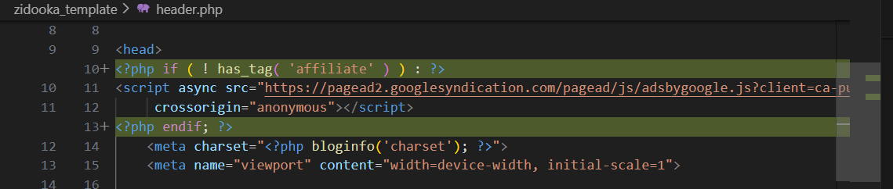

WordPressでブログを運営していると、特定のアフィリエイト記事などではAdSense広告を表示したくない場合があります。
今回は、`affiliate` というタグがついている記事だけAdSenseコードを出力しないように `header.php` をカスタマイズする方法を紹介します。

## header.php の編集

テーマの `header.php` ファイルを開き、AdSenseのコードが記述されている部分を探します。
通常は `<head>` タグの中にあります。

以下のように `has_tag()` 関数を使って条件分岐を追加します。

```php
<head>
<?php if ( ! has_tag( 'affiliate' ) ) : ?>
<!-- AdSenseコード -->
<script async src="https://pagead2.googlesyndication.com/pagead/js/adsbygoogle.js?client=ca-pub-XXXXXXXXXXXXXXXX"
     crossorigin="anonymous"></script>
<?php endif; ?>
	<meta charset="<?php bloginfo('charset'); ?>">
```

※ `ca-pub-XXXXXXXXXXXXXXXX` の部分はご自身のサイト運営者IDに置き換えてください。

## 解説

- `has_tag( 'affiliate' )`: 現在の投稿に `affiliate` というスラッグのタグがついているかを判定します。
- `!`: 否定演算子です。「ついていない場合」に真となります。

これで、記事の編集画面でタグに `affiliate` を追加するだけで、その記事ではAdSenseが非表示になります。



柔軟な広告運用が可能になるので、ぜひ試してみてください。
