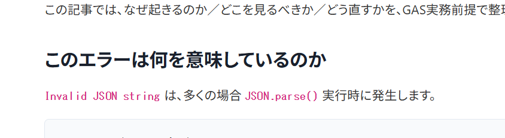

WordPressの記事内で `JSON.parse()` や `UrlFetchApp.fetch()` のようなインラインコードを使っていると、
コントラストは足りているのに、なぜか読みにくいと感じることがあります。

ZIDOOKA!でも実際にこの問題に直面しましたが、結論としては
**色やフォントをいじらず、太字にするだけで十分改善できます。**

この記事では、その理由と最小限のCSS対処法を整理します。

## なぜインライン code は見にくくなりがちなのか

多くのWordPressテーマでは、`code` 要素に対して次のような前提があります。

*   フォントサイズが本文より小さい（0.875em 前後）
*   フォントウェイトが 400（細い）
*   色は付いているが線が細く、行内で沈む

その結果、

**コントラスト比は問題ないのに、日本語本文の中でコードだけが弱く見える**

という状態になります。

これはアクセシビリティの数値ではなく、視認性の問題です。

## 解決策：太字にするだけで十分

見た目を大きく変えたり、フォントを指定したりする必要はありません。
`font-weight` を上げるだけで、体感的な読みやすさは大きく改善します。

### 推奨CSS（インラインコード専用）

```css
p code,
li code,
td code {
  font-weight: 600;
}
```

これだけです。



## なぜ太字が一番効くのか

*   色を変えると主張が強くなりすぎる
*   背景を付けるとUI寄りになる
*   フォント変更は環境依存が大きい

一方で太字は、

*   本文とのコントラストを自然に作れる
*   日本語と英数字の混在でも破綻しにくい
*   スマホ・PCどちらでも効果が安定する

というメリットがあります。

特に Windows + Chrome 環境では、`font-weight: 600` の効果がはっきり出ます。

## やらなくていいこと

今回のケースでは、次の対応は不要でした。

*   色を濃くする
*   背景色を付ける
*   フォントファミリーを指定する
*   `!important` を多用する

「読めない」原因が **細さ** にある場合、
解決も **太さ** で十分です。

## まとめ

WordPressの記事でインラインコードが見にくいと感じたら、
まずは次の1行だけ試してください。

```css
p code { font-weight: 600; }
```

それでも足りない場合に、初めて色や背景を検討すればOKです。

ZIDOOKA!では、
**実務で読めることを最優先に、最小変更で直す**
という方針を取っています。

このケースでは、太字だけで十分でした。
