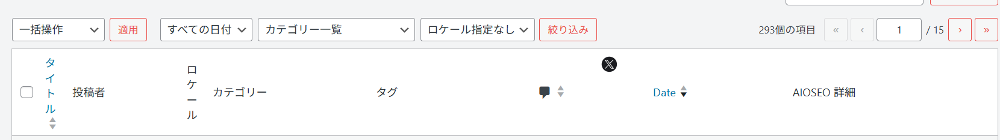
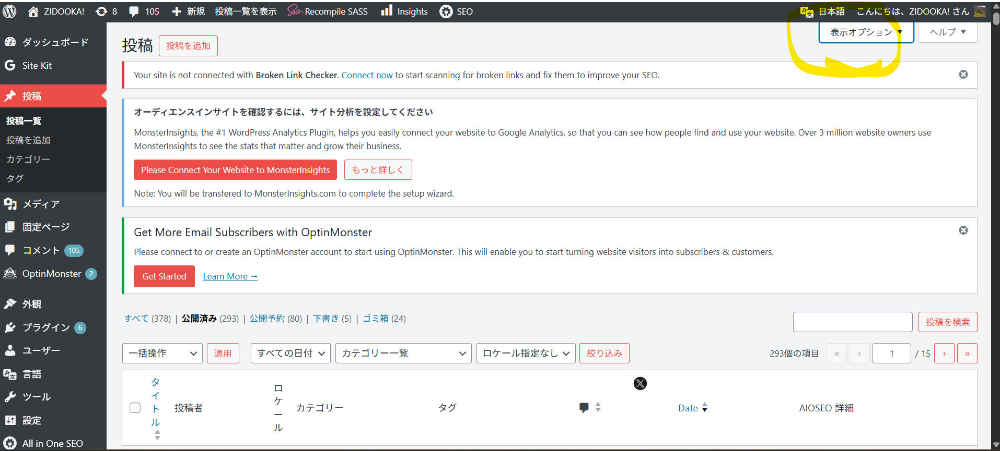

"I uploaded the images."
"This part of WP... there's just too much stuff here, it's annoying. Can't I reduce it?"



I know. It's the classic "Post List becomes the Graveyard of the Admin Panel" situation.
The conclusion is: yes, you can reduce it. And you can do it either "temporarily" or "permanently".

## 1. The Easiest Way: Top Right "Screen Options"

Start with this.

Post List Top Right → "Screen Options"




- ☑ TruSEO Score
- ☑ AIOSEO Details
- ☑ Tags
- ☑ Locale
- ☑ Comments

→ **Just uncheck the ones you don't need.**

- ✅ Per User
- ✅ Works Immediately
- ❌ Needs setting for each user
- ❌ Might come back after plugin updates

If you just think "it's annoying right now", this solves 80% of the problem.

## 2. Ban Columns from Plugins (Recommended)

AIOSEO / TruSEO plugins tend to spawn columns on their own, so deleting them on the WordPress side makes things stable.

Add to `functions.php` (Safe):

```php
// Remove unnecessary columns from post list
add_filter('manage_posts_columns', function ($columns) {
    unset($columns['aioseo-details']); // AIOSEO Details
    unset($columns['aioseo-score']);   // TruSEO Score
    unset($columns['tags']);           // Tags
    unset($columns['comments']);       // Comments
    return $columns;
});
```

*If you have custom post types:*

```php
add_filter('manage_posts_columns', 'remove_post_columns', 100);
add_filter('manage_pages_columns', 'remove_post_columns', 100);
```

- ✅ Common for all users
- ✅ Won't come back even after plugin updates
- ✅ Admin panel becomes a clean "Workspace"

## 3. Stop it in AIOSEO Settings (Official Route)

If you continue to use AIOSEO, this is also an option.

AIOSEO → Settings → Search Appearance or Admin Settings

- "Show TruSEO Score in Post List" → OFF
- "SEO Details Column" → OFF

- ❌ Item names tend to change with versions
- ❌ Sometimes turns back ON

## The ZIDOOKA! Optimal Solution

Assuming your operation style (Massive articles, High speed, CLI posting):

**Conclusion: 2. Delete columns with PHP is the best.**

Reason:
- SEO Score is enough if seen in the "Edit Post" screen.
- The Post List should be a **Production Management View**.
- 293 articles × Horizontal scrolling kills productivity.

### Bonus: Minimum Recommended Configuration

You only need to keep these columns 👇

- ☑ Title
- ☑ Category
- ☑ Author (if needed)
- ☑ Date

→ List = UI for assembly line work.
