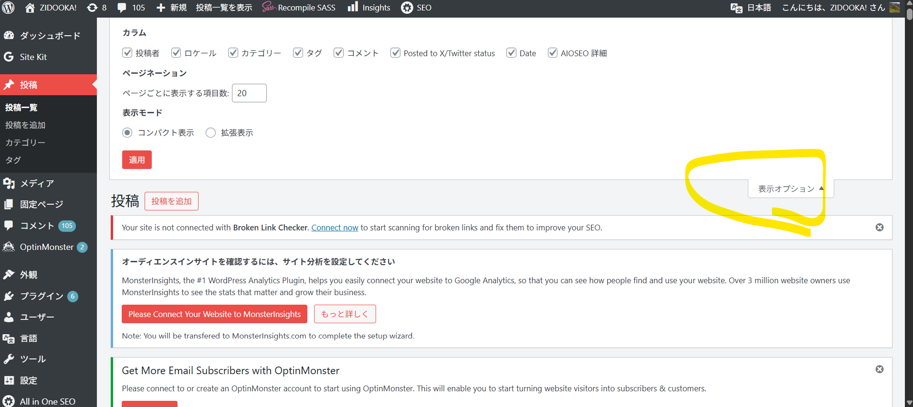

「画像をアップロードしました」
「WPのここさ、めっちゃくちゃありすぎてうざいんだけど減らせない？」


わかる。投稿一覧が「管理画面の墓場」になるやつですね。
結論から言うと、ちゃんと減らせます。しかも「一時的」「恒久的」どっちも可能。

## ① いちばん簡単：画面右上「表示オプション」

まずこれ。

投稿一覧 右上 →「表示オプション」




- ☑ TruSEO スコア
- ☑ AIOSEO 詳細
- ☑ タグ
- ☑ ロケール
- ☑ コメント

→ **不要なチェックを外すだけ**

- ✅ ユーザー単位
- ✅ 今すぐ効く
- ❌ ユーザーごとに設定が必要
- ❌ プラグイン更新で復活することあり

「とりあえず今うざい」ならこれで8割解決。

## ② プラグイン由来の列を“出禁”にする（おすすめ）

AIOSEO / TruSEO 系は勝手に列を生やすので、WordPress側で列を削除すると安定します。

`functions.php` に追加（安全）

```php
// 投稿一覧の不要カラムを削除
add_filter('manage_posts_columns', function ($columns) {
    unset($columns['aioseo-details']); // AIOSEO 詳細
    unset($columns['aioseo-score']);   // TruSEO スコア
    unset($columns['tags']);           // タグ
    unset($columns['comments']);       // コメント
    return $columns;
});
```

※ カスタム投稿タイプがあるなら：

```php
add_filter('manage_posts_columns', 'remove_post_columns', 100);
add_filter('manage_pages_columns', 'remove_post_columns', 100);
```

- ✅ 全ユーザー共通
- ✅ プラグイン更新でも復活しない
- ✅ 管理画面がスッキリ「作業場」になる

## ③ AIOSEO 側の設定で止める（公式ルート）

AIOSEOを使い続けるならここもアリ。

AIOSEO → 設定 → 検索の外観 or 管理画面設定

- 「投稿一覧に TruSEO スコアを表示」→ OFF
- 「SEO 詳細カラム」→ OFF

- ❌ バージョンで項目名が変わりがち
- ❌ ONに戻ることがある

## ZIDOOKA!的な最適解

あなたの運用（大量記事・高速回転・CLI投稿）前提だと、

**結論：② PHPで列を削除 がベスト**

理由：
- SEOスコアは「記事編集画面」で見れば十分
- 投稿一覧は **制作管理ビュー** であるべき
- 293記事 × 横スクロールは生産性を殺す

### おまけ：最低限おすすめ構成

残す列はこれだけでいい👇

- ☑ タイトル
- ☑ カテゴリー
- ☑ 投稿者（必要なら）
- ☑ 日付

→ 一覧＝流れ作業のためのUI
