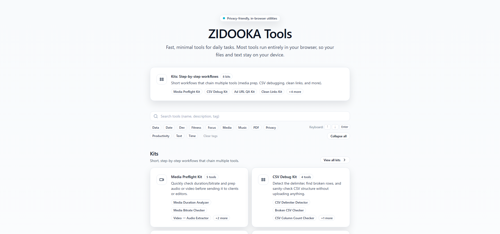

zidooka.com には2つの顔があります。メインサイトはWordPressで運営する技術ブログ、もう1つは React + Vercel で構築したツール集 **tools.zidooka.com** です。今回は、この2サイト構成の設計思想と、AIを活用した独自の開発アプローチについて、運営者にインタビューしました。

## 2サイトの棲み分け：なぜ分けたのか

:::note
**メインサイト（zidooka.com）**
- WordPress（Traditional CMS）
- 技術記事・チュートリアル・エラー解説
- SEO重視のメディア運営

**ツールサイト（tools.zidooka.com）**
- React + Vercel（Modern Jamstack）
- 実用ツール集（現在30種類程度）
- GitHub管理によるCI/CD
:::

「サブドメインに分けたのはなんとなく」という運営者の言葉通り、当初は明確な戦略があったわけではありません。しかし結果として、**コンテンツ（WP）と機能（React）の責務を分離**できる良い構成になりました。

WordPressは記事管理に長け、SEOプラグインやエディタの使いやすさが魅力。一方、ツール開発はVercelの高速デプロイとGitHub連携が最適でした。

## 「おすそわけ」哲学：自分が欲しいものを作る

tools.zidooka.com のツールは30種類。その全てが「自分がほしいなーと思ったもの」から始まっています。

:::conclusion
**開発の出发点**

1. 日常業務で「これ自動化できないかな」と思う
2. とりあえず作って自分で使う
3. 「他の人も使えるかも」と公開する
4. フィードバックを受けて改善

この「おすそわけ」スタイルが、無理のない継続的開発につながっています。
:::

## ピボット型開発：方向転換を恐れない

「ツールは順次拡張してる！ピボットするイメージ」という言葉が示す通り、このプロジェクトは**固定的なロードマップではなく、柔軟な方向転換**を重視しています。

良い反応があれば深掘りし、使われなければ次に移る。ユーザーからのリクエストやアクセス解析を見ながら、リアルタイムで優先順位を調整します。

## AI駆動の自律的改善：次なる実験

最も興味深いのが、このサイトの将来像です。

:::warning
**次世代開発フローの実験**

- Search Consoleやアクセス解析をAIが監視
- 改善点を自動検出・提案
- コード生成からデプロイまでAIが担当
- 人間は最終判断と創造的な部分に集中

いわゆる「バイブコーディング」の先を行く、**AIによる自律的フィードバックループ**の構築を目指しています。
:::

## なぜこの構成を選んだのか

| 観点 | WordPress（メイン） | React/Vercel（ツール） |
|------|---------------------|------------------------|
| **管理** | ブラウザ UI で直感的 | GitHub でコード管理 |
| **SEO** | プラグイン充実 | API Routes で柔軟対応 |
| **開発速度** | 記事執筆に特化 | ホットリロード高速 |
| **拡張性** | プラグイン依存 | npm パッケージ自由 |

「本体はWPで、toolsはVercel-GitHub管理にしたかった」という運営者の要望通り、**それぞれの強みを活かしたハイブリッド構成**となっています。

## ミニSaaSとしての可能性

tools.zidooka.com は単なる「便利ツール集」ではなく、**ミニSaaS（Software as a Service）としての成長可能性**を秘めています。

- 無料で使える実用ツールでユーザー獲得
- 使い込むほど価値を感じる設計
- 将来的な有料プランやAPI提供も視野に

「おすそわけ」から始まったプロジェクトが、気づけば小さなサービスへと進化していく。これこそが、個人開発者にとっての理想的な形かもしれません。

## まとめ：個人開発の新しい形

WP × Vercel × AI という3つの要素が交差するこのプロジェクトは、従来の「ブログかアプリか」という二者択一を超えた、**ハイブリッドな個人開発のモデルケース**と言えるでしょう。

:::conclusion
**設計思想の核心**

- **分離**：コンテンツと機能を適材適所で分ける
- **実用**：自分の課題解決が出发点
- **柔軟**：ピボットを恐れず方向転換
- **自動化**：AIに繰り返し作業を任せ、人間は創造に集中

このアプローチは、個人開発者や小規模チームにとって大きな示唆を与えてくれます。
:::

---

**関連記事**

- [Vercel で React アプリをホスティングする方法](https://www.zidooka.com/vercel-react-hosting/)
- [AI による自動化ワークフロー構築ガイド](https://www.zidooka.com/ai-automation-workflow/)

**参考リンク**

- [tools.zidooka.com](https://tools.zidooka.com) — 実用ツール集
