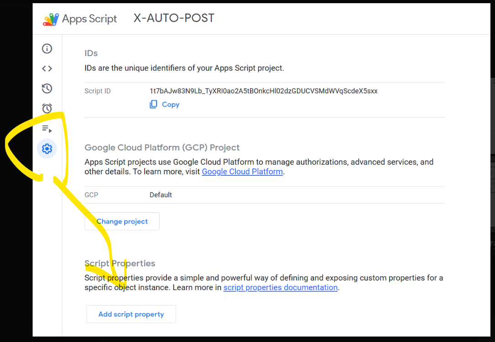
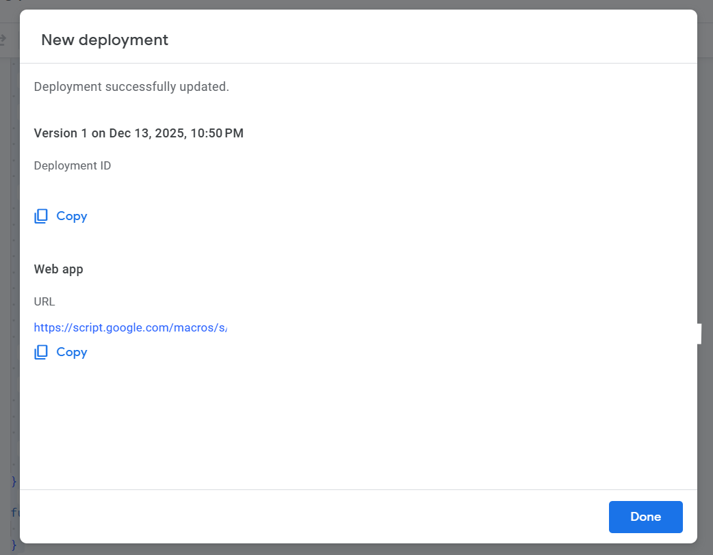

Auto-posting from WordPress to X (formerly Twitter).
To achieve this, many people rely on plugins.

However, if you run a media site for a long time, you inevitably face these problems:

*   **"The plugin suddenly stopped working."**
*   **"Posts are failing due to API limits, but I don't know why."**
*   **"An update wiped out my settings."**

Plugins meant to make life easier often become the **biggest source of instability**.

Recently, I encountered a situation where "WordPress POST hooks stopped working."
So, I decided to stop relying on existing plugins and built a **"bulletproof distribution infrastructure"** using **Google Apps Script (GAS)** and **X API v2**.

I am convinced this is the **ultimate configuration** for individual media operators.

## Design Philosophy: WordPress Should Only "Notify"

The core concept of this tool is **"Don't let WordPress do unnecessary work."**

### Traditional Plugin Architecture
*   WordPress holds the "X Authentication Credentials".
*   WordPress handles the "Posting Process to X".
*   WordPress handles "Error Handling".

This makes WP heavy and insecure (if WP is compromised, your X account is too).

### My "Ultimate Configuration"
*   **WordPress**: Just throws a JSON to GAS when an article is published.
*   **GAS**: Handles authentication, posting, logging, and retries.
*   **Spreadsheet**: Records and visualizes posting logs.

```
[WordPress]
    ↓ (POST: Title, URL)
[Google Apps Script] ← Secret keys are isolated here
    ↓ (OAuth 1.0a)
[X API v2]
    ↓
[Spreadsheet] (Log: Success/Fail)
```

With this setup, **even if WordPress is compromised, your X account remains safe**.
Also, if X changes its API specs, you only need to fix the GAS side.

## Tech Stack

*   **WordPress**: A few lines of hooks in `functions.php`
*   **Google Apps Script**: Signing and POSTing to X API v2 (No libraries used)
*   **X API**: v2 API (`/2/tweets`) usable even on the Free plan
*   **Authentication**: OAuth 1.0a (Generating signatures within GAS)

## Implementation Guide: Step-by-Step

Here is the step-by-step guide to building this tool.
Even if you are not familiar with programming, you can complete it by following these instructions.

### Step 1: Create a Spreadsheet for Logs

First, create a new Google Spreadsheet in your Google Drive.
Enter the following headers in the first row:

*   Column A: `time`
*   Column B: `post_id`
*   Column C: `text`
*   Column D: `tweet_id`
*   Column E: `status`
*   Column F: `error`


Note down the `ID` part of this spreadsheet's URL (the string between `/d/` and `/edit`), as you will need it later.

### Step 2: Open GAS Project

From the spreadsheet menu, click **"Extensions" -> "Apps Script"**.
This opens the GAS editor linked to this sheet.

### Step 3: Get Keys from X Developer Portal

Access the [X Developer Portal](https://developer.twitter.com/en/portal/dashboard) and create a project (Free plan is fine).
From the **"Keys and tokens"** tab, get the following 4 pieces of information:

1.  **API Key** (Consumer Key)
2.  **API Key Secret** (Consumer Secret)
3.  **Access Token**
4.  **Access Token Secret**

*Note: When generating the Access Token, make sure to grant **"Read and Write"** permissions.*


### Step 4: Set Script Properties

Return to the GAS editor and click the gear icon (Project Settings) on the left.
In the **"Script Properties"** section at the bottom, set the keys you just obtained and the Sheet ID from Step 1.

| Property | Value |
| :--- | :--- |
| `X_API_KEY` | (Your API Key) |
| `X_API_SECRET` | (Your API Key Secret) |
| `X_ACCESS_TOKEN` | (Your Access Token) |
| `X_ACCESS_SECRET` | (Your Access Token Secret) |
| `LOG_SHEET_ID` | (Your Spreadsheet ID) |


### Step 5: Paste the Code

Go back to the "Editor (`<>` icon)" on the left and replace the entire content of `Code.gs` with the following code.
No external libraries are required.



```javascript
function doPost(e) {
  const data = JSON.parse(e.postData.contents);

  if (!data.text || !data.text.trim()) {
    return json({ ok: false, error: 'empty text' });
  }

  try {
    const tweetId = postToX(data.text);

    logToSheet([
      new Date(),
      data.post_id || '',
      data.text,
      tweetId,
      'success',
      ''
    ]);

    return json({ ok: true });

  } catch (err) {
    logToSheet([
      new Date(),
      data.post_id || '',
      data.text,
      '',
      'failed',
      err.toString()
    ]);

    return json({ ok: false, error: err.toString() });
  }
}

/* X API v2 Post (Manual OAuth1 Implementation) */
function postToX(text) {
  const props = PropertiesService.getScriptProperties();

  const url = 'https://api.twitter.com/2/tweets';
  const method = 'POST';

  const oauth = {
    oauth_consumer_key: props.getProperty('X_API_KEY'),
    oauth_token: props.getProperty('X_ACCESS_TOKEN'),
    oauth_nonce: Utilities.getUuid(),
    oauth_timestamp: Math.floor(Date.now() / 1000),
    oauth_signature_method: 'HMAC-SHA1',
    oauth_version: '1.0'
  };

  const baseParams = Object.assign({}, oauth);
  const baseString =
    method + '&' +
    encodeURIComponent(url) + '&' +
    encodeURIComponent(
      Object.keys(baseParams)
        .sort()
        .map(k => `${encodeURIComponent(k)}=${encodeURIComponent(baseParams[k])}`)
        .join('&')
    );

  const signingKey =
    encodeURIComponent(props.getProperty('X_API_SECRET')) + '&' +
    encodeURIComponent(props.getProperty('X_ACCESS_SECRET'));

  const signatureBytes = Utilities.computeHmacSignature(
    Utilities.MacAlgorithm.HMAC_SHA_1,
    baseString,
    signingKey
  );

  oauth.oauth_signature = Utilities.base64Encode(signatureBytes);

  const authHeader = 'OAuth ' + Object.keys(oauth)
    .sort()
    .map(k => `${encodeURIComponent(k)}="${encodeURIComponent(oauth[k])}"`)
    .join(', ');

  const res = UrlFetchApp.fetch(url, {
    method: 'post',
    headers: {
      Authorization: authHeader,
      'Content-Type': 'application/json'
    },
    payload: JSON.stringify({ text }),
    muteHttpExceptions: true
  });

  const body = JSON.parse(res.getContentText());

  if (!body.data || !body.data.id) {
    throw new Error(res.getContentText());
  }

  return body.data.id;
}

/* Log to Sheet */
function logToSheet(row) {
  const sheet = SpreadsheetApp
    .openById(PropertiesService.getScriptProperties().getProperty('LOG_SHEET_ID'))
    .getSheets()[0];

  sheet.appendRow(row);
}

function json(obj) {
  return ContentService
    .createTextOutput(JSON.stringify(obj))
    .setMimeType(ContentService.MimeType.JSON);
}
```

### Step 6: Deploy as Web App

Click **"Deploy" -> "New deployment"** in the top right.

1.  **Select type**: Click the gear icon and select **"Web app"**.
2.  **Description**: Enter anything (e.g., `v1`).
3.  **Execute as**: `Me`.
4.  **Who has access**: **`Anyone`** ← **Important!**


Click "Deploy" to generate a URL (Web App URL).
Copy this URL (you will use it in the WordPress settings).

---

## Implementation Step 2: WordPress Side

On the WordPress side, just add the following code to `functions.php`.
It hooks only when an article is "published" and sends data to GAS.

```php
/**
 * WordPress → GAS → X Auto Post
 * ZIDOOKA! Production Config
 */
add_action('transition_post_status', function ($new_status, $old_status, $post) {

  // Run only when status becomes 'publish'
  if ($old_status === 'publish' || $new_status !== 'publish') return;

  // Limit to 'post' type
  if ($post->post_type !== 'post') return;

  // Exclude autosaves and revisions
  if (wp_is_post_autosave($post->ID) || wp_is_post_revision($post->ID)) return;

  // Prevent double posting (managed by meta data)
  if (get_post_meta($post->ID, '_x_posted', true)) return;

  // Get title and URL
  $title = trim(wp_strip_all_tags($post->post_title));
  if ($title === '') return;

  $title = mb_substr($title, 0, 100); // Limit length
  $url   = get_permalink($post->ID);

  // Create post text
  $text = "【New Post】\n{$title}\n\n{$url}";

  // GAS Web App URL (Issued earlier)
  $gas_url = 'https://script.google.com/macros/s/YOUR_GAS_ID/exec';

  // POST to GAS
  $response = wp_remote_post(
    $gas_url,
    [
      'timeout' => 5,
      'headers' => ['Content-Type' => 'application/json'],
      'body' => wp_json_encode([
        'post_id' => $post->ID,
        'text'    => $text
      ])
    ]
  );

  // Save flag on success
  if (!is_wp_error($response)) {
    update_post_meta($post->ID, '_x_posted', 1);
  }

}, 10, 3);
```

### Caution: The `functions.php` Trap
During implementation, I accidentally wrote `<?php` twice in the middle of `functions.php`, causing the hook to fail silently.
`functions.php` only needs `<?php` at the very beginning of the file. Writing it in the middle can cause syntax errors, so be careful.

## Benefits Realized in Operation

I've started using this setup, and the **stability is on another level**.

1.  **Failures are Visible**: All logs are kept in the Spreadsheet, so it's obvious "when" and "why" something failed.
2.  **Easy Retry**: Even if it fails, you can retry just by hitting the GAS endpoint again.
3.  **High Extensibility**: Extensions like "changing hashtags by category" or "posting to Bluesky simultaneously" can be done entirely within GAS.



## Summary

"Installing a plugin" is easy, but it also means "holding a black box".
If you plan to run a media site for the long term, building a configuration that **"you can fix yourself when it breaks"** is the shortest path to success.

This "WordPress × GAS × X API" configuration should be the **ultimate weapon** for individual developers and bloggers.
Please give it a try.
