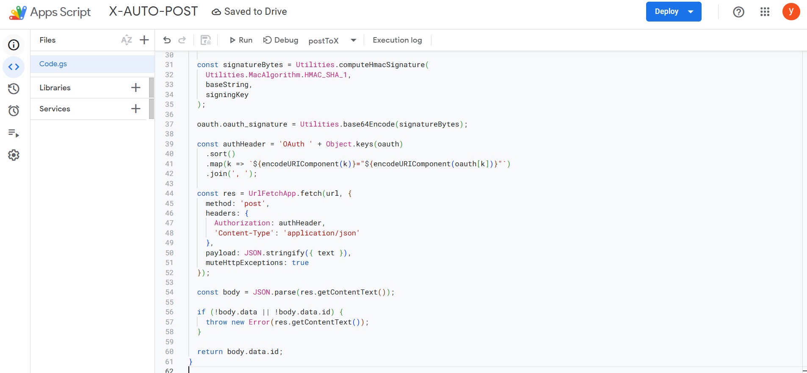
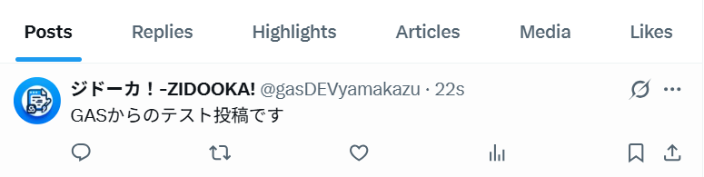
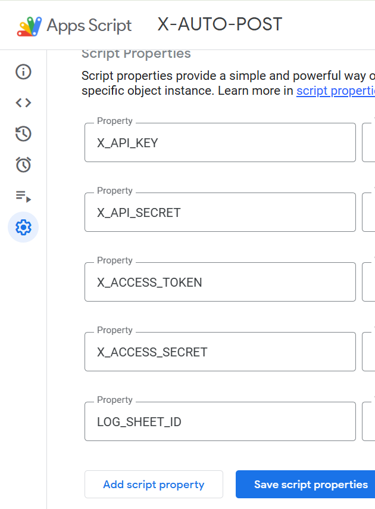
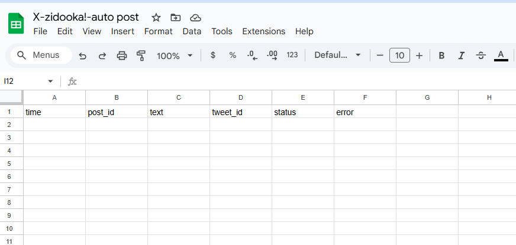

WordPressからX（旧Twitter）への自動投稿。
これを実現するために、多くの人がプラグインを使っていると思います。

しかし、長年メディアを運用していると、必ずこの問題に直面します。

*   **「プラグインが突然動かなくなった」**
*   **「API制限で投稿が失敗しているが、理由が分からない」**
*   **「アップデートで設定が飛んだ」**

楽をするためのプラグインが、実は**最大の不安定要因**になってしまうのです。

今回、私も「WP側のPOSTが働かなくなった」というトラブルに見舞われました。
そこで、既存のプラグインに頼るのをやめ、**Google Apps Script (GAS)** と **X API v2** を組み合わせて、**「絶対に壊れない（壊れても自分で直せる）配信基盤」** を自作しました。

これが、個人メディアにおける**最強の構成**だと確信しています。

## 設計思想：WordPressは「通知するだけ」

今回のツールの肝は、**「WordPressに余計な仕事をさせない」** ことです。

### 従来のプラグイン構成
*   WordPressの中に「Xの認証情報」を持つ
*   WordPressが「Xへの投稿処理」を行う
*   WordPressが「エラーハンドリング」を行う

これだと、WPが重くなるし、セキュリティ的にも不安です（WPが乗っ取られたらXも乗っ取られます）。

### 今回の「最強構成」
*   **WordPress**：記事が公開されたら、GASに「JSON」を投げるだけ。
*   **GAS**：認証・投稿・ログ保存・再送処理を一手に引き受ける。
*   **Spreadsheet**：投稿ログを記録し、可視化する。

```
[WordPress]
    ↓ (POST: Title, URL)
[Google Apps Script] ← ここに秘密鍵を隔離
    ↓ (OAuth 1.0a)
[X API v2]
    ↓
[Spreadsheet] (Log: Success/Fail)
```

この構成なら、**WordPressが侵害されてもXのアカウントは無事**です。
また、XのAPI仕様が変わっても、GAS側を1箇所直すだけで済みます。

## 技術構成

*   **WordPress**: `functions.php` に数行のフックを追加
*   **Google Apps Script**: X API v2 への署名とPOST処理（ライブラリ不使用）
*   **X API**: Freeプランでも使える v2 API (`/2/tweets`)
*   **認証方式**: OAuth 1.0a（GAS単体で署名を生成）

## 実装手順：完全ガイド

ここからは、実際にこのツールを構築する手順をステップバイステップで解説します。
プログラミングに詳しくない方でも、手順通りに進めれば完成します。

### 手順1：ログ保存用のスプレッドシートを作成

まず、Googleドライブで新しいスプレッドシートを作成します。
1行目に以下の見出しを入力してください。

*   A列: `time`
*   B列: `post_id`
*   C列: `text`
*   D列: `tweet_id`
*   E列: `status`
*   F列: `error`



このスプレッドシートのURLに含まれる `ID` 部分（`/d/` と `/edit` の間の文字列）を後で使うので、メモしておきます。

### 手順2：GASプロジェクトを開く

スプレッドシートのメニューから **「拡張機能」→「Apps Script」** をクリックします。
これで、このシートに紐付いたGASエディタが開きます。

### 手順3：X Developer Portal でキーを取得

[X Developer Portal](https://developer.twitter.com/en/portal/dashboard) にアクセスし、プロジェクトを作成します（FreeプランでOK）。
**「Keys and tokens」** タブから、以下の4つの情報を取得します。

1.  **API Key** (Consumer Key)
2.  **API Key Secret** (Consumer Secret)
3.  **Access Token**
4.  **Access Token Secret**

※ Access Token を生成する際は、必ず **「Read and Write」** 権限が付与されていることを確認してください。



### 手順4：スクリプトプロパティの設定

GASのエディタに戻り、左側の歯車アイコン（プロジェクトの設定）をクリックします。
一番下にある **「スクリプト プロパティ」** に、先ほど取得したキーと、手順1でメモしたシートIDを設定します。

| プロパティ名 | 値 |
| :--- | :--- |
| `X_API_KEY` | (取得したAPI Key) |
| `X_API_SECRET` | (取得したAPI Key Secret) |
| `X_ACCESS_TOKEN` | (取得したAccess Token) |
| `X_ACCESS_SECRET` | (取得したAccess Token Secret) |
| `LOG_SHEET_ID` | (スプレッドシートのID) |



### 手順5：コードの貼り付け

左側の「エディタ（`<>`アイコン）」に戻り、`Code.gs` の中身を以下のコードにすべて書き換えます。
外部ライブラリは一切不要です。


```javascript
function doPost(e) {
  const data = JSON.parse(e.postData.contents);

  if (!data.text || !data.text.trim()) {
    return json({ ok: false, error: 'empty text' });
  }

  try {
    const tweetId = postToX(data.text);

    logToSheet([
      new Date(),
      data.post_id || '',
      data.text,
      tweetId,
      'success',
      ''
    ]);

    return json({ ok: true });

  } catch (err) {
    logToSheet([
      new Date(),
      data.post_id || '',
      data.text,
      '',
      'failed',
      err.toString()
    ]);

    return json({ ok: false, error: err.toString() });
  }
}

/* X API v2 投稿（OAuth1 手書き実装） */
function postToX(text) {
  const props = PropertiesService.getScriptProperties();

  const url = 'https://api.twitter.com/2/tweets';
  const method = 'POST';

  const oauth = {
    oauth_consumer_key: props.getProperty('X_API_KEY'),
    oauth_token: props.getProperty('X_ACCESS_TOKEN'),
    oauth_nonce: Utilities.getUuid(),
    oauth_timestamp: Math.floor(Date.now() / 1000),
    oauth_signature_method: 'HMAC-SHA1',
    oauth_version: '1.0'
  };

  const baseParams = Object.assign({}, oauth);
  const baseString =
    method + '&' +
    encodeURIComponent(url) + '&' +
    encodeURIComponent(
      Object.keys(baseParams)
        .sort()
        .map(k => `${encodeURIComponent(k)}=${encodeURIComponent(baseParams[k])}`)
        .join('&')
    );

  const signingKey =
    encodeURIComponent(props.getProperty('X_API_SECRET')) + '&' +
    encodeURIComponent(props.getProperty('X_ACCESS_SECRET'));

  const signatureBytes = Utilities.computeHmacSignature(
    Utilities.MacAlgorithm.HMAC_SHA_1,
    baseString,
    signingKey
  );

  oauth.oauth_signature = Utilities.base64Encode(signatureBytes);

  const authHeader = 'OAuth ' + Object.keys(oauth)
    .sort()
    .map(k => `${encodeURIComponent(k)}="${encodeURIComponent(oauth[k])}"`)
    .join(', ');

  const res = UrlFetchApp.fetch(url, {
    method: 'post',
    headers: {
      Authorization: authHeader,
      'Content-Type': 'application/json'
    },
    payload: JSON.stringify({ text }),
    muteHttpExceptions: true
  });

  const body = JSON.parse(res.getContentText());

  if (!body.data || !body.data.id) {
    throw new Error(res.getContentText());
  }

  return body.data.id;
}

/* ログ保存 */
function logToSheet(row) {
  const sheet = SpreadsheetApp
    .openById(PropertiesService.getScriptProperties().getProperty('LOG_SHEET_ID'))
    .getSheets()[0];

  sheet.appendRow(row);
}

function json(obj) {
  return ContentService
    .createTextOutput(JSON.stringify(obj))
    .setMimeType(ContentService.MimeType.JSON);
}
```

### 手順6：デプロイ（Webアプリとして公開）

右上の **「デプロイ」→「新しいデプロイ」** をクリックします。

1.  **種類の選択**: 歯車アイコンから **「ウェブアプリ」** を選択。
2.  **説明**: 適当に入力（例: `v1`）。
3.  **次のユーザーとして実行**: `自分` (Me)。
4.  **アクセスできるユーザー**: **`全員` (Anyone)** ← **ここ重要！**



「デプロイ」ボタンを押すと、URL（ウェブアプリURL）が発行されます。
このURLをコピーしておきます（WordPressの設定で使います）。

---

## 実装手順：WordPress側の設定

WordPress側は、`functions.php` に以下のコードを追加するだけです。
記事が「公開 (publish)」された瞬間だけフックし、GASにデータを投げます。

```php
/**
 * WordPress → GAS → X 自動投稿
 * ZIDOOKA! 用 本番構成
 */
add_action('transition_post_status', function ($new_status, $old_status, $post) {

  // publish になった瞬間のみ実行
  if ($old_status === 'publish' || $new_status !== 'publish') return;

  // 投稿タイプ制限（通常の投稿のみ）
  if ($post->post_type !== 'post') return;

  // 自動保存・リビジョン除外
  if (wp_is_post_autosave($post->ID) || wp_is_post_revision($post->ID)) return;

  // 二重投稿防止（メタデータで管理）
  if (get_post_meta($post->ID, '_x_posted', true)) return;

  // タイトルとURLを取得
  $title = trim(wp_strip_all_tags($post->post_title));
  if ($title === '') return;

  $title = mb_substr($title, 0, 100); // 文字数制限
  $url   = get_permalink($post->ID);

  // 投稿文の作成
  $text = "【新記事】\n{$title}\n\n{$url}";

  // GAS Web App URL（先ほど発行したもの）
  $gas_url = 'https://script.google.com/macros/s/YOUR_GAS_ID/exec';

  // GAS に POST
  $response = wp_remote_post(
    $gas_url,
    [
      'timeout' => 5,
      'headers' => ['Content-Type' => 'application/json'],
      'body' => wp_json_encode([
        'post_id' => $post->ID,
        'text'    => $text
      ])
    ]
  );

  // 成功したらフラグ保存
  if (!is_wp_error($response)) {
    update_post_meta($post->ID, '_x_posted', 1);
  }

}, 10, 3);
```

### 注意点：`functions.php` の罠
実装時、`functions.php` の途中に `<?php` を二重に書いてしまい、フックが動かないというミスがありました。
`functions.php` はファイルの先頭に `<?php` があれば十分です。途中に書くと構文エラーの原因になるので注意しましょう。

## 運用してわかったメリット

実際にこの構成で運用を始めましたが、**安定感が段違い**です。

1.  **失敗が見える**: スプレッドシートに全てのログが残るため、「いつ」「なぜ」失敗したかが一目瞭然です。
2.  **再送が簡単**: 失敗しても、GASを叩き直すだけで再送できます。
3.  **拡張性が高い**: 「カテゴリによってハッシュタグを変える」「Blueskyにも同時に投げる」といった拡張が、GAS側だけで完結します。


## まとめ

「プラグインを入れる」のは簡単ですが、それは「ブラックボックスを抱える」ことでもあります。
長期的にメディアを運営するなら、**「壊れたときに自分で直せる」** 構成にしておくことが、結果的に一番の近道になります。

この「WordPress × GAS × X API」の構成は、個人開発者やブロガーにとっての**最強の武器**になるはずです。
ぜひ試してみてください。
