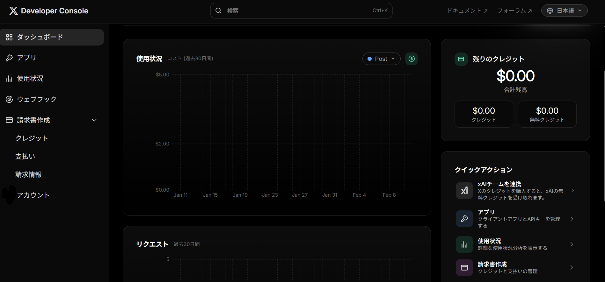
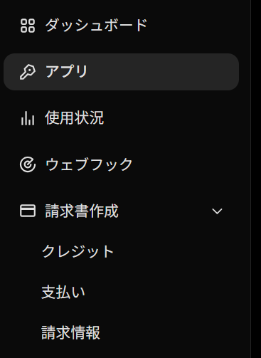
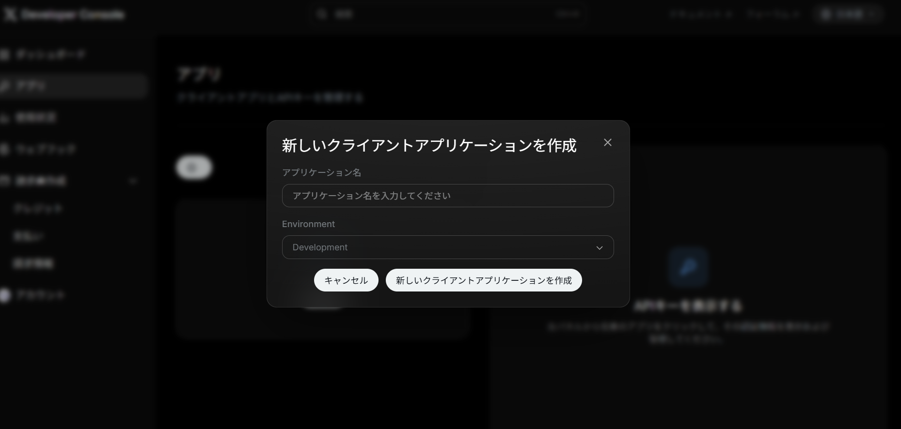
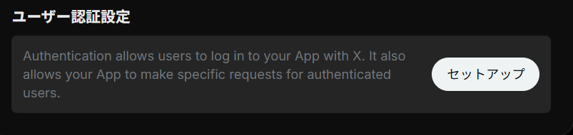

X（旧Twitter）のAPIを利用するために必要な「API Key」「API Key Secret」「Bearer Token」の取得手順を、2026年現在の最新画面（Developer Portal）に基づいて解説します。

:::note
**前提条件**
*   Xのアカウントを持っていること（電話番号認証済みが推奨されます）。
*   X Developer Platformへの登録が済んでいること（Freeプラン、Basicプラン、Proプランなど）。
:::

## 手順の概要

1.  Developer Consoleへアクセス
2.  プロジェクトとアプリを作成
3.  APIキーの発行と保存
4.  ユーザー認証（OAuth 2.0）の設定

---

## 手順詳細

:::step
### 1. Developer Consoleにアクセス

まずはブラウザで **Developer Console**（<https://console.x.com/accounts/>）にアクセスし、開発者登録済みのアカウントでログインします。

ダッシュボードが表示されます。ここがAPI管理のホーム画面です。


:::

:::step
### 2. アプリ管理画面へ移動

サイドメニューにある「**Projects & Apps**」の項目をクリックするか、ダッシュボード上のアプリアイコンをクリックして、アプリの管理画面へ移動します。

まだアプリがない場合は、「Overview」などからプロジェクトを作成するプロセスに入ります。


:::

:::step
### 3. 新しいアプリを作成 (Add App)

プロジェクト内の「**Add App**」ボタン、またはスタンドアロンの「**Create App**」ボタンをクリックします。
ここから新しいクライアントアプリケーションの設定が始まります。


:::

:::step
### 4. アプリ名と環境の設定

アプリの基本情報を入力します。

*   **App Name (名前)**: アプリの名前を入力します。
    *   :::warning
        **注意**: 名前は全Xアプリの中でユニーク（一意）である必要があります。また、「Twitter」「X」「Admin」などの予約語は使用できません。エラーが出る場合は、末尾に数字や独自の文字列をつけて調整してください。
        :::
*   **App Environment (環境)**:
    *   **Production**: 本番環境。通常はこちらを選択します。
    *   **Development / Staging**: 開発用や検証用。

入力後、「Next」をクリックします。
:::

:::step
### 5. APIキーの保存（最重要）

アプリが作成されると、最初のAPIキーとトークンが表示されます。

*   **API Key** (Consumer Key)
*   **API Key Secret** (Consumer Secret)
*   **Bearer Token** (App-only authentication用)

:::warning
**警告**: これらのキー（特にSecret）は、**この画面を閉じると二度と表示されません**。
必ずこの場でコピーし、パスワード管理ツールや `env` ファイルなどの安全な場所に保存してください。もし紛失した場合は、「Regenerate（再発行）」を行う必要があり、既存のアプリの連携が切れてしまいます。
:::
:::

:::step
### 6. ユーザー認証設定（User Authentication Settings）

APIキーを発行しただけでは、ツイートの投稿やログイン機能（OAuth）が使えない場合があります。
アプリの設定画面（Settings）にある「**User authentication settings**」の「**Set up**」をクリックして設定を行います。



設定項目:
*   **App permissions**:
    *   **Read**: 読み取りのみ。
    *   **Read and Write**: 投稿も行うならこれを選択。
    *   **Read and Write and Direct Message**: DMも扱う場合。
*   **Type of App**:
    *   **Web App, Automated App or Bot**: botやサーバーサイドアプリの場合。
    *   **Native App**: モバイルアプリなどの場合。
*   **App info**:
    *   **Callback URI / Redirect URL**: OAuth認証後の戻り先。開発中は `http://localhost:3000/callback` などでも可。
    *   **Website URL**: アプリの公式サイトや作者のプロフィールURL。

最後に「Save」を押すと、**Client ID** と **Client Secret** が発行されます。これらもOAuth 2.0を利用する場合に必要になるので保存しておきましょう。
:::

---

## 開発のヒント

### APIキーの管理について
取得したAPIキーをプログラムに直接書き込む（ハードコーディングする）のはセキュリティ上危険です。GitHubなどに誤ってアップロードしないよう、環境変数（`.env` ファイルなど）を利用して管理することを強く推奨します。

```bash
# .envファイルの例
X_API_KEY=your_api_key
X_API_SECRET=your_api_key_secret
X_BEARER_TOKEN=your_bearer_token
```

:::conclusion
**まとめ**

1.  Developer Console (<https://console.x.com/accounts/>) でアプリを作成。
2.  アプリ名は世界で唯一のものにする。
3.  発行されたKeyとSecretは**その場で確実に保存**する（再表示不可）。
4.  ツイート投稿などを行う場合は「User Authentication Settings」で権限設定 (Read and Write) を行う。

これで、Bot開発やWebサイトへの埋め込みなど、X APIを活用する準備が整いました。
:::
