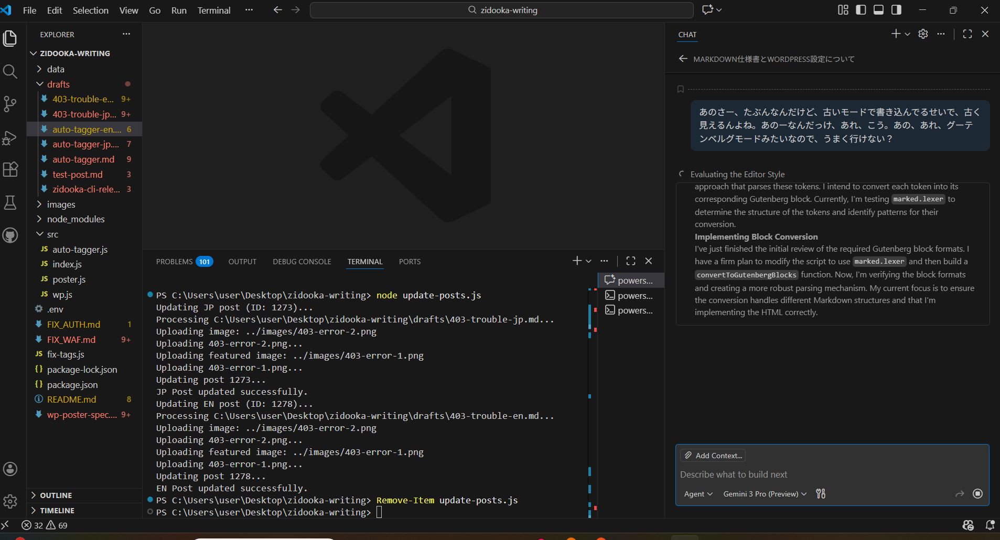
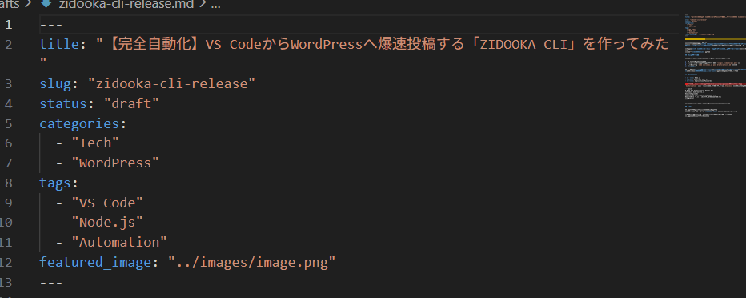

# Tired of the Slow WordPress Admin Panel?

Hello, this is ZIDOOKA!
Do you write your blog posts directly in the WordPress admin editor?
Honestly, isn't it **slow, clunky, and annoying to manage images**?

As a developer, I spend most of my time in **VS Code**. I always thought, "If only I could write articles here and post them with a single command..."

**So, I built it.**

Introducing **"ZIDOOKA CLI"**.



## What Can This Tool Do?

Built with Node.js, this tool interacts with the WordPress REST API to automate the posting process.
Here are the key features:

1.  **Write in Markdown**: Write comfortably using standard Markdown syntax.
2.  **Auto Image Upload**: Just reference local images like ``, and the tool uploads them and updates the links automatically.
3.  **Auto-Convert to Gutenberg Blocks**: This is the killer feature. It doesn't just dump HTML; it converts Markdown into native WordPress "Blocks", making it easy to edit later.
4.  **WAF/403 Bypass**: Includes logic to bypass strict server security (like SiteGuard) that often blocks API requests.

## How It Works

Usage is simple. Write a Markdown file in VS Code, then run the command in the terminal:

```bash
node src/index.js post drafts/my-article.md
```

That's it. Your article is uploaded with all images properly placed.

### The Gutenberg Conversion

Traditional Markdown converters often result in a single "Classic Block" or "Custom HTML" block, which looks outdated.
My tool parses the Markdown and converts it into proper **Heading, Paragraph, Image, and Code blocks**.


As you can see, it looks native in the WordPress editor.

## Dev Story: Fighting the 403 Forbidden

The hardest part of development was dealing with **"403 Forbidden" errors**.
Even after disabling the WAF, image uploads were blocked, or English posts were rejected.


I eventually solved this by implementing a **"Two-Step Posting Strategy"**: creating an empty draft first, then updating the content. This successfully bypassed the server-side spam filters.

## Conclusion

"If you don't have it, build it." That's the joy of programming.
Thanks to this tool, my writing workflow has improved dramatically.



If you are a developer who wants to post from VS Code, I highly recommend trying to build your own CLI with Node.js and WP REST API. It's easier than you think!
