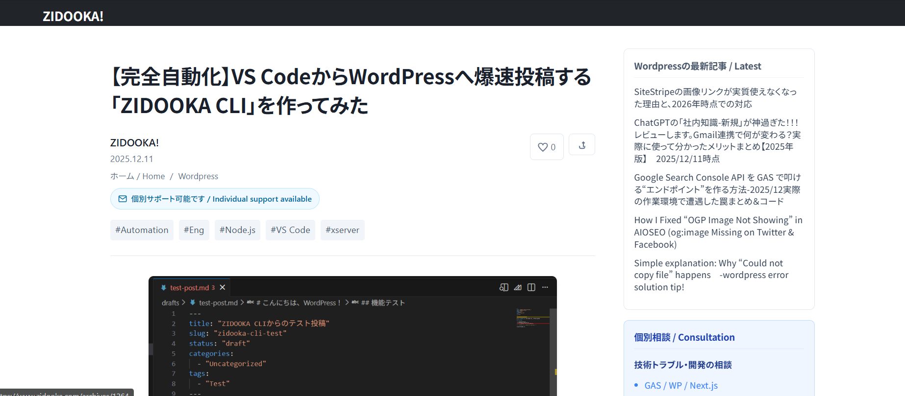

# WordPressの管理画面、重くないですか？

ブロガーの皆さん、こんにちは。ZIDOOKA! です。
記事を書くとき、WordPressの管理画面のエディタを使っていますか？
正直、**動作がもっさりしていたり、画像のアップロードが面倒だったり**しませんか？

私は普段、開発で **VS Code** を使っているので、「このままVS Codeで記事を書いて、コマンド一発で投稿できたら最高なのに…」と常々思っていました。

**なので、作りました。**

名付けて **「ZIDOOKA CLI」** です。


## 何ができるツールなのか？

このツールは Node.js で作られており、WordPress REST API を叩いて記事を投稿します。
主な機能は以下の通りです。

1.  **Markdownで執筆可能**: 慣れ親しんだMarkdown記法でサクサク書けます。
2.  **画像の自動アップロード**: 記事内に `` と書くだけで、投稿時に画像を自動でアップロードし、リンクを差し替えてくれます。
3.  **Gutenbergブロックへの自動変換**: これが最大のこだわりです。単なるHTMLではなく、WordPress標準の「ブロック」として投稿されるため、後から管理画面で編集するのも容易です。
4.  **WAF/403エラー回避**: 海外サーバーやセキュリティプラグイン（SiteGuardなど）によるブロックを回避するロジックも組み込みました。

## 実際の挙動

使い方はシンプルです。VS CodeでMarkdownファイルを書き、ターミナルでコマンドを叩くだけ。

```bash
node src/index.js post drafts/my-article.md
```

これだけで、画像付きの記事が公開（または下書き保存）されます。

### こだわりのGutenberg変換

従来のMarkdown変換ツールだと、すべてが「クラシックブロック」や「カスタムHTML」になってしまい、見た目が崩れることがありました。
今回のツールでは、Markdownを解析して **「見出しブロック」「段落ブロック」「画像ブロック」「コードブロック」** に適切に変換しています。



このように、管理画面で見ても違和感がありません。

## 開発の裏話：403エラーとの戦い

開発中、最も苦労したのが **「403 Forbidden」エラー** です。
WAFを切っても画像アップロードが弾かれる、英語の記事だけ投稿できない…といった謎の現象に悩まされました。


最終的に、**「空の下書きを作ってから中身を更新する」** という2段階投稿プロセスを実装することで、サーバー側のスパムフィルターを回避することに成功しました。

## まとめ

「欲しいものがなければ作る」。これがプログラミングの醍醐味ですね。
このツールのおかげで、執筆体験が劇的に向上しました。


もし「自分もVS Codeから投稿したい！」というエンジニアの方がいれば、ぜひNode.jsとWP REST APIで自作してみてください。意外と簡単ですよ！
