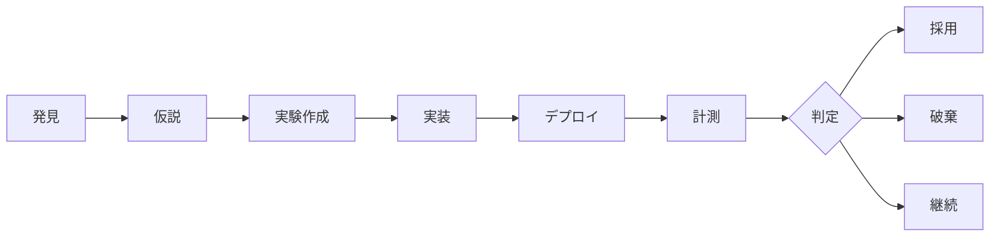

# PostHog A/B テスト

## プロジェクト別

| 項目 | zidooka_writing | benri-tools |
|------|----------------|-------------|
| フラグプレフィックス | `zdk_*` | `calendar-*` |
| 割当方式 | Server-side (body class + cookie) | Client-side (PostHog SDK) |
| 同時稼働上限 | 1本（最大2本） | 3本 |
| チェックコマンド | `npm run posthog:check` | `npm run ph:status`, `npm run ph:analyze` |

## 実験ライフサイクル

### ステップ詳細

1. **発見**: データ異常・機会検出 → 改善候補を特定
2. **仮説**: 「XをYに変えるとZが改善する」形式
3. **実験作成**: PostHog API で Experiment + Feature Flag 作成
4. **実装**: `useFeatureFlag()` で variant 分岐
5. **デプロイ**: `git push origin main`
6. **計測**: 7〜14日
7. **判定**: adopt / continue / stop

## 意思決定閾値

| 条件 | zidooka | benri-tools |
|------|---------|-------------|
| 最低期間 | 5日 | 7日（推奨14日） |
| 最小impression/variant | 200 | 100 |
| 最小outcome/variant | 100 | 100（アウトカムイベント） |
| 意味のあるlift | 15% | 20%（完了率） |
| 最大null rate | 30% | — |

## Experiment Health Ladder (benri-tools)

`PostHog Experiment result: not yet available` を「何もわからない」と扱わない:

1. **Configured**: Experiment / Feature Flag / variants が存在する
2. **Allocating**: impression が variants 間で分配されている
3. **Exposed**: treatment UI のイベントが発火している
4. **Outcome-ready**: 主要アウトカムに十分なデータが variant ごとに揃った
5. **Decidable**: 主要メトリクス + ガードレールが adopt / continue / stop を支持する
