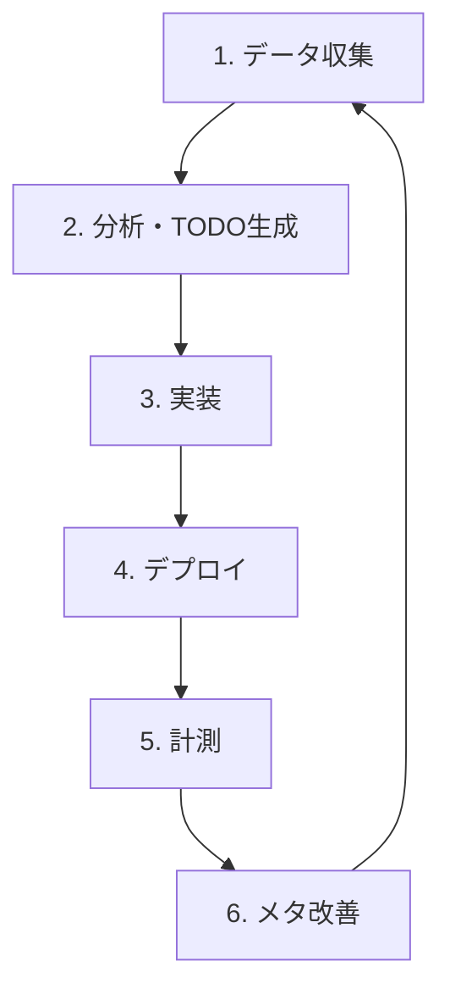

# 自己改善サイクル

## 基本ループ

## トリガー一覧

| トリガー | アクション | コマンド/手順 |
|---------|-----------|-------------|
| セッション開始時 | 判断記録の検証 | `npm run decisions` → 該当データ確認 |
| 週1回 | 全チャネルデータ収集 | `npm run improve` → TODO生成 |
| 実験7日経過 | 実験判定 | `npm run ph:analyze` |
| 検証日到達 | 判断結果の追記 | 該当 decision record を更新 |
| 30日ごと | 過去判断の振り返り | 正答率計算 → `daily-agent/retro.md` |

## アラート条件

| メトリクス | 閾値 | 超過時のアクション | 対象 |
|-----------|------|------------------|------|
| PostHog null rate | 30% | 計装トラブルシュート | zidooka |
| tool_error (週) | 50件 | 内訳調査＋修正提案 | benri-tools |
| ad_empty (週) | 1000件 | 広告在庫確認 | benri-tools |
| RPM | ¥170→¥100 | 広告設定確認 | 両方 |
| Bing crawl error | 30% | robots.txt確認 | 両方 |
| GSC low CTR | 3%未満 & 100imp+ | SEO改善 | 両方 |
| ad fill rate (Desktop) | 70%→60% | 広告スロット見直し | 両方 |

## フィードバックルール

結果が期待通り → 判断基準を維持
結果が期待以下 → なぜズレたかを分析し判断基準を修正
結果が不明 → データ不足。さらに待つか計測方法を改善
